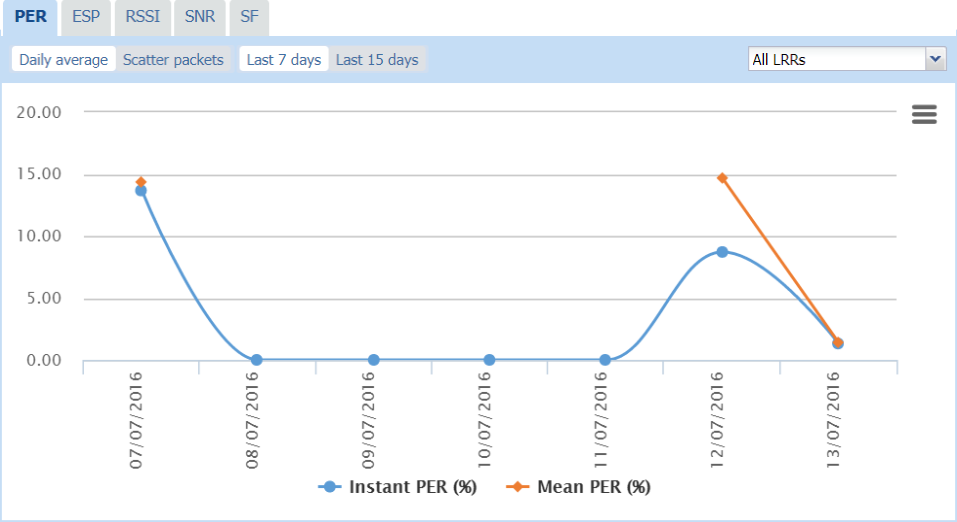
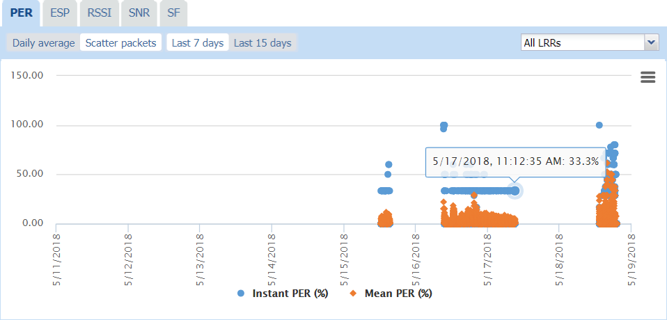
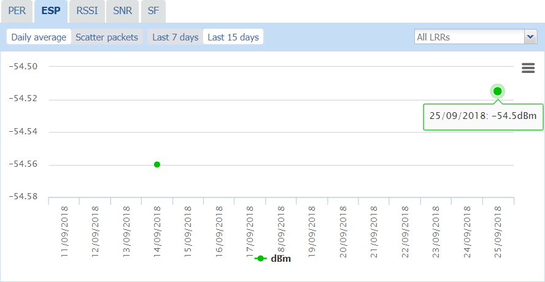
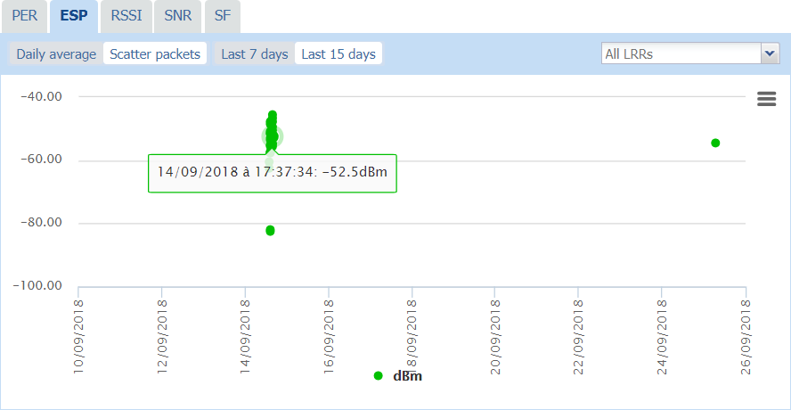
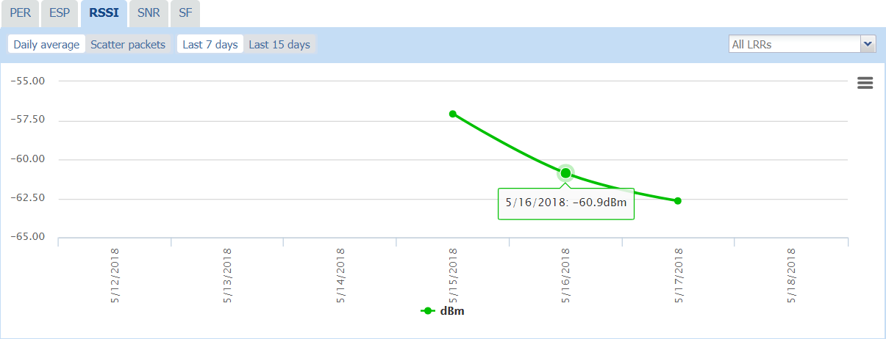
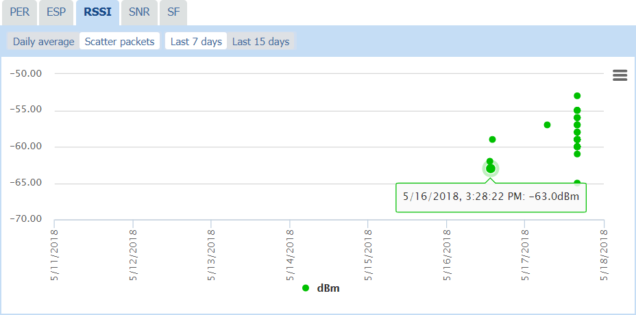
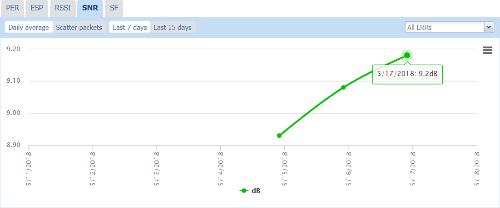
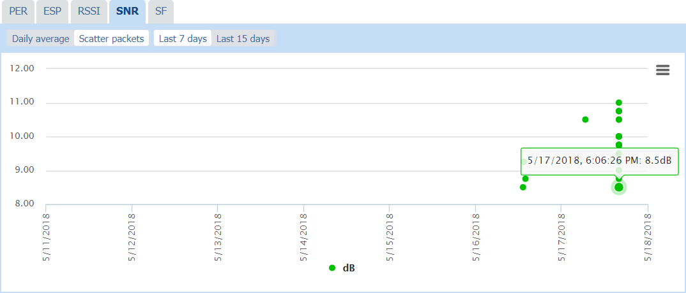
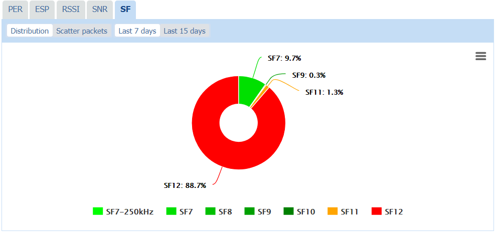
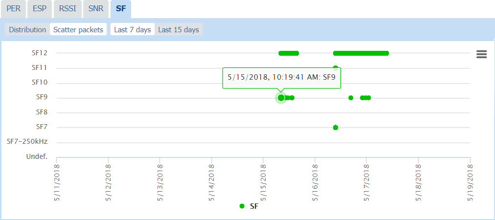

# Monitoring radio statistics of a LoRaWAN® device

You can display charts representing the following radio statistics to
help you monitor or troubleshoot a LoRaWAN® device:

- **Packet Error Rate (PER)** with **Instant PER** and **Mean PER**

- **Estimated Signal Power (ESP)**

- **Received Signal Strength Indicator (RSSI)**

- **Signal-to-Noise Ratio (SNR)**

- **Spreading Factor (SF)**

This information is read-only. For more information about how devices
radio statistics is defined and computed in Device Manager, see [More about LoRaWAN® radio statistics](./dmug-more-lorawan-radio-statistics.md).

On the charts, you can display the following details for each device:

- **Daily average** or **Scatter packets** (**Distribution** or
  **Scatter packets** for SF)

- Over the **Last 7 days** or the **Last 15 days**

- For **All LRRs**, or a specific LRR, in the range of the device (Does
  not applies to SF).

**Tips**

- Hovering your mouse over an item of the chart displays additional
  traffic information.

- Clicking an item of the caption makes it disappear/appear in the chart
  and adjusts the scale.

 

1.  In the navigation panel, click **Devices** to display the Devices
    panel, then click the List or the **Map** tab.

2.  Select the device you want to check the activity. Click **View** or
    **Edit** to enter the Device panel.

3.  Scroll down the Device panel to display the **PER**, **ESP**,
    **RSSI**, **SNR** and **SF** tabs with the charts.

4.  Click the **PER** tab, then:

    - Click **Daily** average and
      **Last 7 days,** or **Last 15 days**, to view:

      - The daily average PER of the device over the selected period for
        all LRRs.

      - If available, select a specific LRR in the **All LRRs** list to
        display the Instant PER per LRR that is computed considering
        only the uplink frames received by a specific LRR.

        

    - Click **Scatter packets** and **Last 7 days,** or **Last 15
      days**, to view:

      - The device PER per packet over the selected period for all LRRs.
        If available, you can select a specific LRR in the **All LRRs**
        list.

        

5.  Click the **ESP** tab, then:

    - Click **Daily average** and **Last 7 days,** or **Last 15 days**,
      to view:

      - The daily average ESP of the device over the selected period for
        All LRRs. If available, you can select a specific LRR in the
        **All LRRs** list.

        

    - Click **Scatter packets** and **Last 7 days,** or **Last 15
      days**, to view:

      - The device ESP per packet over the selected period for all LRRs.
        If available, you can select a specific LRR in the **All LRRs**
        list.

        

6.  Click the **RSSI** tab, then:

    - Click **Daily average** and **Last 7 days,** or **Last 15 days**,
      to view:

      - The daily average RSSI of the device over the selected period
        for All LRRs. If available, you can select a specific LRR in the
        **All LRRs** list.

        

    - Click **Scatter packets** and **Last 7 days**, or **Last 15
      days**, to view:

      - The device RSSI per packet over the selected period for all
        LRRs. If available, you can select a specific LRR in the **All
        LRRs** list.

        

7.  Click the **SNR** tab, then:

    - Click **Daily average** and **Last 7 days,** or **Last 15 days**,
      to view:

      - The daily average SNR of the device over the selected period for
        All LRRs. If available, you can select a specific LRR in the
        **All LRRs** list.

        

    - Click **Scatter packets** and **Last 7 days,** or **Last 15
      days**, to view:

      - The device SNR per packet over the selected period for all LRRs.
        If available, you can select a specific LRR in the **All LRRs**
        list.

        

8.  Click the **SF** tab, then:

    - Click **Distribution** and **Last 7 days,** or **Last 15 days**,
      to view:

      - The distribution of the spreading factors over the selected
        period.

        

    - Click **Scatter packets** and **Last 7 days,** or **Last 15
      days**, to view:

      - The Spreading Factors used per packet over the selected period.

        

9.  If you want to remove some information from the chart, click the
    corresponding item in the chart caption. It also adjusts the scale
    according to the information displayed.

10. If you want to print or download this chart, see [Printing or downloading a chart](../device-manager-user-guide/manage-a-device/check-device-settings-activity.md#printing-or-downloading-a-chart).
