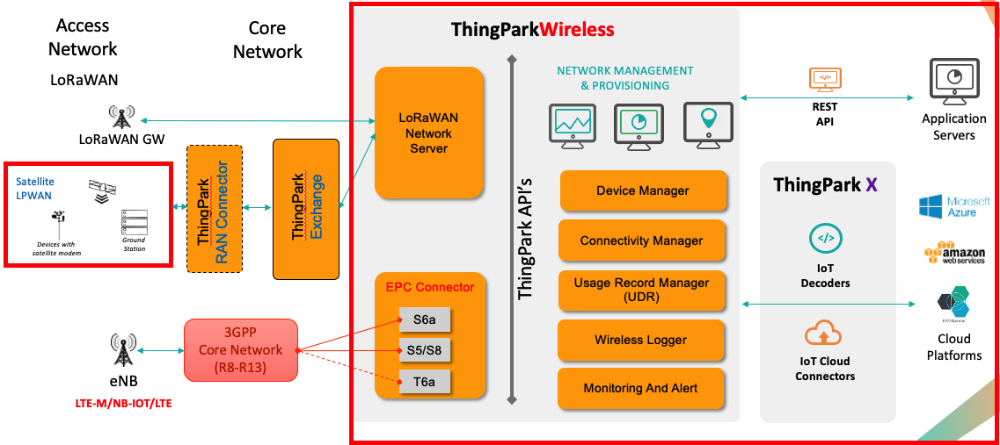

# ThingPark Cellular feature overview

ThingPark Evolved Packet Core (EPC) Connector is an add-on to ThingPark Wireless that allows interconnection with 3GPP core network to manage the cellular devices with the following features.

<strong>Interoperability with 3GPP compliant interfaces</strong>

ThingPark Wireless EPCC offers 3GPP compliant integration over standard 3GPP interfaces:
- S6a interface is used to interface with MME of a mobile operator network and HSS (inside EPCC)
- S5/S8 interface is used to interface with SGW of a mobile operator network and PGW (inside EPCC)
- T6a interface is used to process Non-IP Data Delivery (NIDD) traffic from the device

<strong>Support of both message mode and Direct IP modes</strong>

ThingPark Wireless EPCC supports both message mode and Direct IP traffic. 
- The message mode is used to send small packets less than 1400 bytes over UDP with a specific source port (configurable in ThingPark Wireless routing profile). Non-IP Data delivery (NIDD) payloads are also sent using message mode. The message mode traffic can be further processed by [ThingPark X IoT Flow](https://docs.thingpark.com/thingpark-x/latest/Overview/) which allows integration with numerous cloud connectors and it has in built drivers to decode device payloads.
- The Direct IP mode is used for the rest of the traffic (for ex, videos, TCP based communication, etc)

<strong>Power saving/wireless logging features in message mode</strong>

- The message mode allows the device to send only the payloads which it intends to send to the application server. The communicataion with cloud platforms can be done using [ThingPark X IoT Flow](https://docs.thingpark.com/thingpark-x/latest/Overview/). This allows the device to save significant power as all the communication happens over UDP or NIDD, while at the same time customer applications can build applications in cloud platforms and interact with the device using cloud connector using ThingPark X IoT Flow.

- The message mode traffic can also be decoded in [Wireless logger](/B-Feature-Topics/network-tools/wireless-logger/overview) using built-in drivers in ThingPark X IoT Flow. ThingPark X also allows the customers to build custom drivers for their devices.

<strong>IoT specific Policy enforcement features</strong>

ThingPark Wireless offers policy enforcement on the device at two levels:
- For the message mode traffic, the device traffic is limited by the message mode settings in the connectivity plan. You can find more information about connectivity plans in [Connectivity Manager](https://docs.thingpark.com/thingpark-wireless/7.2/docs/user-guide-tpw/supplier/use-connectivity-manager/)
- For the direct IP traffic, the connectivity plan configures the uplink/downlink bandwidth limits which are sent in the 3GPP signalling towards the core network which are applied by the radio access network (RAN) and Core network

<strong>IoT specific Rating features</strong>

ThingPark Wireless offers the charging records which can be expported into the billing system of an operator to charge their customers. For more information on usage detail records, see [here](https://docs.thingpark.com/thingpark-wireless/7.2/docs/user-guide-tpw/operator/documentation-library#usage-detail-records)

<strong>Hardware based Security of IoT devices (HSM)</strong>

ThingPark Wireless offers the ability to store the SIM card secret keys(Ki) and Operator Key (OP) in HSM. HSM is hardware based server that is tamper-proof and stores the keys. EPC connector communicates with HSM over standard IP interface to generate authentication vectors that are sent in 3GPP signalling. This offers robust secuirity in contrast to storing the keys in the cloud inside EPC Connector. For more information on HSM, see [here](https://docs.thingpark.com/thingpark-wireless/7.2/docs/user-guide-tpw/supplier/use-connectivity-manager/pre-provision-cellular-devices#hsm-principles)

<strong>Multi-tenancy to share resources within several Enterprise clients</strong>

ThingPark Wireless is designed with multi-tenant architecture allowing the same platform to be shared across several enterprise customers.

<strong>OSS APIs for Integration with 3rd Party platforms</strong>

ThingPark Wireless offers rich set of APIs allowing the automation of IoT workflow and integration with third party platforms.

<strong>Support for cloud connectors, drivers using ThingPark X</strong>

ThingPark Wireless offers support for numerous cloud connectors, drivers using ThingPark X (for message mode traffic) thus facilitating the end-to-end integration. For more information on ThingPark X, see [here](https://docs.thingpark.com/thingpark-x/latest/Overview/)

