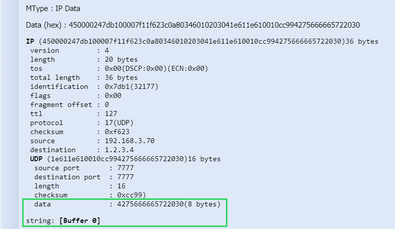

# Decoding cellular payloads

You can decode and display all cellular payloads included in the current
page of the Last packets list of your
search result.

If the payload contains text data, the cellular decoder converts it and
displays the text strings in addition to the raw hexadecimal format
displayed by default.

&nbsp;

1.  (Recommended) Refine your search regarding the type of packets your
    want to decode. You can only decode packets including data. For more
    information, see [Searching packets](../filtering/search-packets)
    and [Quick filtering](../filtering/quick-filtering).

2.  From the **Decoder** list, select **ASCII**.

3.  Click **Refresh** icon.

    -\&gt; All packets of the current page of the Last packets list corresponding to the
    selected decoder have their payloads decoded.

4.  Do one of the following:

    - To display a specific payload, click **+** icon on the left side
      of the packet.

      -\&gt; The string text is displayed below the payload in raw format.
      
      

    - To display all decoded payloads, select **Expand All**.
