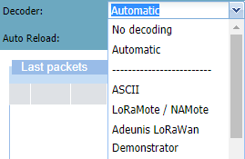
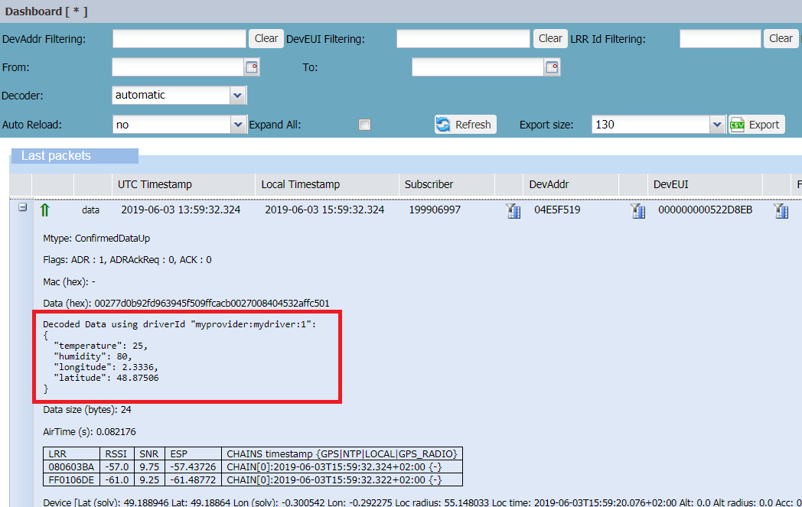

# Decoding LoRaWAN® payloads

You can decode and display all LoRaWAN® payloads included in the current
page of the Last packets list of your
search result if the corresponding decoders are known to Wireless
Logger.

A LoRaWAN® payload decoder deserializes the payload and extracts
meaningful data values to display the payload with the application data.

Decoding of LoRaWAN® applicative payloads in Wireless Logger is only
possible in the following cases:

- **For ABP devices**: The AppSKey must be provisioned in ThingPark by
  the subscriber.

- **For OTA devices**: The AppKey must be provisioned in ThingPark by
  the subscriber. **Note** OTA devices using HSM mode (or using HSM mode
  and External Join Server mode like in ThingPark Activation) cannot
  have their LoRaWAN® applicative payloads decoded.

1.  (Recommended) Refine your search regarding the type of packets your
    want to decode. You can only decode packets including data. For more
    information, see [Searching packets](../filtering/search-packets)
    and [Quick filtering](../filtering/quick-filtering).

2.  From the **Decoder** list of the LoRaWAN® Dashboard, select your decoder as follows:

    - **No decoding**: All applicative uplink/downlink payloads are
      displayed in raw format. This is the default setting.

    - **Automatic**: The right decoder is automatically identified for
      each device based on the driver metadata associated with the
      device profile. **Note** When **Automatic** is selected, the
      decoded data is also included in the export file, along with
      information about the driver. For more information, see [LoRaWAN®       export file](../lorawan-traffic/lorawan-export-file).

    - If using versions earlier than ThingPark 6.1, select another
      decoder from the list. This option is essentially kept for
      backward compatibility, especially in case the decoder type is not
      yet integrated with IoT Flow driver catalog.

      

3.  Click **Refresh** icon.

    -\> All packets of the current page of the Last packets list corresponding to the
    selected decoder have their payloads decoded.

4.  Do one of the following:

    - To display a specific payload, click **+** icon
      on the left side
      of the packet.

      -\> In our example, the payload data has been automatically
      decoded by Wireless Logger application.
      
      

    - To display all decoded payloads, select **Expand All**.
