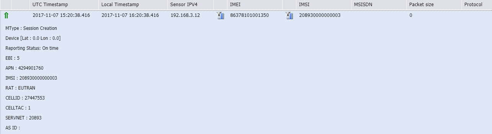
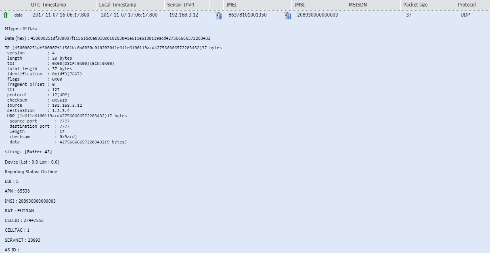
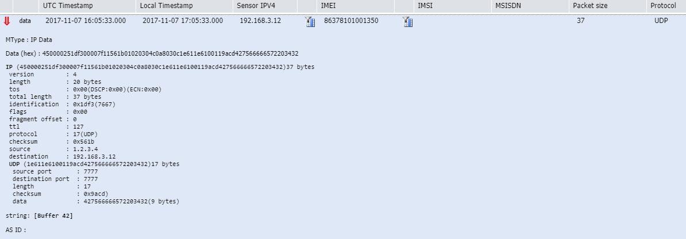
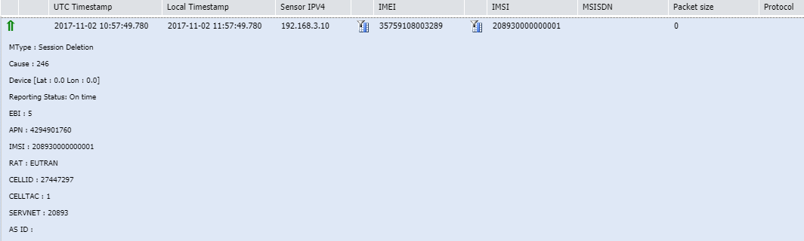
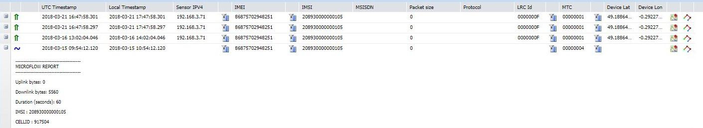

# Cellular traffic details

This topic provides quick access to all information you can display when
expanding cellular packets and reports in Wireless Logger. For more
information, see [Expanding packets](../analyzing/expand-packets.md).

## Session creation

**MType: Session Creation** This is an uplink
packet when the device successfully connects to the eNodeB/Core network.
It means that the device is successfully registered to the network.

It is created in the last step of the LTE Attach procedure when the SGW
of the operator's core network sends a session creation request to the
MTC-LTE-GW within the EPC connector. Then, the EPC connector forwards it
to the LRC within ThingPark Wireless.

## Uplink payload

**data** This is the typical uplink UDP
payload that is captured by the LRC when the device is doing uplink
traffic in packet mode between itself and the application server.

**Note** The UDP source port is 7777 which classifies uplink UDP packet
received by the MTC-LTE-GW as a message mode packet.

## Downlink payload

**data** This is the typical downlink
payload that is captured by the LRC when the application server is doing
downlink traffic in message mode between itself and the device.

However, the device needs to always initiate the uplink traffic first
with the application server before the application server can start any
downlink traffic.

## Session deletion

**MType: Session Deletion** This packet is
received when the device detaches from the network for some reason. For
example, when it loses connectivity or is switched off. It is sent from
the MTC-LTE-GW to the LRC when receiving a session deletion request from
the SGW.

## Microflow report

This packet is sent
from MTC-LTE-GW to TWA (through Kafka) whenever there is direct IP mode
traffic. It is not the actual payload, but only the statistics of the
traffic that passes through MTC-LTE-GW.

