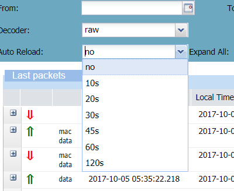

# Autoreloading search

To always get the latest packets, you can set a period of time to
refresh regularly the result of your search.

1.  From the **Auto Reload** list, select the period of time you want.

    

    -\&gt; When the period of time has expired, the Last packets list refreshes automatically.
