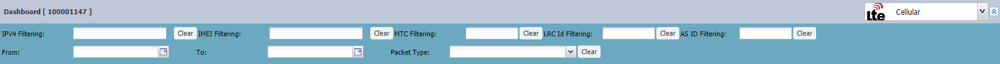
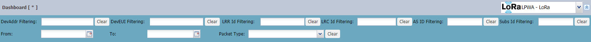

# Searching packets

You can use filters to search packets and reports in your traffic. When
entering no criteria, you can retrieve up to 10 000 packets displayed on
100 pages. One page contains 100 packets.

**Tips** Except for date filters, all filters support multiple entries
as follows:

- In a filter box, type several values separated by comma. When using
  [Quick filtering](quick-filtering), type then a comma and type
  manually the next value.

- In a filter list, select several items in the list.

To delete your selection, click **Clear**.

1.  Use the following filters as you want.

    **For cellular**
    
    

    | Filter             | Description                                                                                                                                   |
    |--------------------|-----------------------------------------------------------------------------------------------------------------------------------------------|
    | **IPV4 Filtering** | IP address assigned to a cellular device on LTE network                                                                                       |
    | **IMEI Filtering** | International Mobile Equipment Identity                                                                                                       |
    | **MTC Filtering**  | Machine Type Communication, that is the identification number of the EPC Connector; the latter's equivalent in LoRaWAN® is a LRR base station |
    | **Packet Type**    | Filters packets by type/direction of traffic or filters report by selecting one or more items of the list                                     |
    | **LRC Id Filtering** | Filters all packets routed to a specific LRC network server.                                                                                                               |
    | **AS ID Filtering**  | Only available in Wireless Logger attached to a subscriber account. It allows you filtering uplink or downlink packets being exchanged with a specific application server. |
    | **From/To**          | Filters all packets received on a specific date/time range. The date/time setting refers to **local time**. Time zone is retrieved from the PC browser settings.           |

    **For LoRaWAN®**
    
    

    | Filter | Description |
    | ------ | ----------- |
    | **DevAddr Filtering** | Filters devices by Device address. Use the * character to enter a DevAddr part. Example: `*01234` | 
    | **DevEUI Filtering** |Filters devices by Device EUI. Use the * character to enter a DevEUI part. Example: `*01234` |
    | **LRR Id Filtering** | Filters all packets received by a specific LRR base station as their best LRR. If the same uplink packet is received by several LRRs, filtering will apply to only the best LRR. The best LRR is the LRR receiving the uplink packet with the highest Signal-to-Noise Ratio. For more information, see [LoRaWAN® radio statistics](../lorawan-traffic/lorawan-traffic-overview.md#lorawan-radio-statistics) |
    | **Subs ID filtering** | Only available in Wireless Logger attached to a network partner account. The corresponding **Subscriber ID** column is located between the **Local Timestamp** and the **DevAddr** columns. |
    | **Packet Type** | Filters packets by type/direction of traffic or filters reports by selecting one or more items from the list (multivalued supported):  **For uplink packets** ** - Uplink (Data only)**: Displays only uplink packets with applicative payload (no MAC commands, no ACK). **- Uplink (MAC + Data)**: Displays uplink packets including both applicative payload and MAC data (MAC commands, ACK). **- Uplink (MAC only)**: Displays uplink packets without applicative payload; that is to say, having only MAC commands and/or MAC acknowledgments. Empty packets are also counted as MAC-only packets. **- Uplink (Join)**: Displays Join Request packets.  **For downlink packets** **- Downlink Unicast (Data only)**: Displays only downlink unicast packets with applicative payload (no MAC commands, no ACK) .**- Downlink Unicast (MAC + Data)**: Displays downlink packets including both applicative payload and MAC data (MAC commands, ACK). **- Downlink Unicast (MAC only)**: Displays downlink unicast packets without applicative payload; that is to say, having only MAC commands and/or MAC acknowledgments. Empty packets are also counted as MAC-only packets. **- Downlink Unicast (Join)**: Displays Join Accept packets. **- Downlink Multicast**: Displays only downlink multicast packets with applicative payload. **Note:** Multicast packets do not include MAC commands/ACKs.  **For reports** **- Multicast Summary**: Displays only multicast summary reports related to a multicast group. **- Location**: Display location reports. **- Device Reset**: Displays reset notifications for ABP devices.|
    | **LRC Id Filtering** | Filters all packets routed to a specific LRC network server. | 
    | **AS ID Filtering** | Only available in Wireless Logger attached to a subscriber account. It allows you filtering uplink or downlink packets being exchanged with a specific application server. |
    | **From/To** | Filters all packets received on a specific date/time range. The date/time setting refers to **local time**. Time zone is retrieved from the PC browser settings. |

2.  Click **Refresh** to launch the
    search and reload packets.

    -\> In the status bar, a message tells you the number of packets
    loaded in the first page of results.

3.  Click **Next** to check if the result of your search contain more
    pages. Repeat as necessary.

4.  (Optional) To see more packets on your screen, see [Extending the     dashboard](../viewing/extend-dashboard).

5.  (Optional) Restrict you search as necessary, for example using
    [Quick filtering](quick-filtering).
