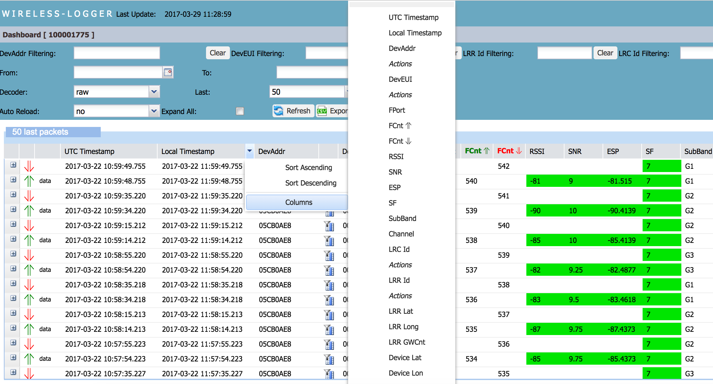

# Sorting packets

Using the arrow at the top of columns in the Last
packets list, you can sort the packets to your needs. You can
also hide and show the columns you want to customize your dashboard.

Columns in the Last packets list display the most important metadata of the packet.

For more information, see:

- **For LoRaWAN®**: [Uplink metadata   columns](../lorawan-traffic/uplink-lorawan-packets.md#uplink-metadata-columns)
  and [Downlink metadata   columns](../lorawan-traffic/downlink-lorawan-unicast-packets.md#downlink-metadata-columns)

- **For cellular**: [Cellular metadata columns](../cellular-traffic-tpw/cellular-traffic-overview.md#cellular-metadata-columns).

For more information, see [Uplink metadata columns](../lorawan-traffic/uplink-lorawan-packets.md#uplink-metadata-columns) and [Downlink metadata columns](../lorawan-traffic/downlink-lorawan-unicast-packets.md#downlink-metadata-columns).

1.  On the base station list, hover your mouse over a column header you
    want, then click the arrow to display more options:

    - Click **Sort Ascending** or **Sort Descending** to sort the
      packets according to this metadata. **Note** The sorting function
      only applies to the current page. It does not sort packets over
      all pages.

2.  Use the **Column** menu to hide or show the columns you want.

    **Note** The **Columns** menu is the same for all columns.

