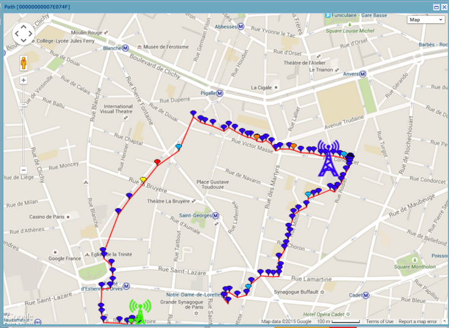

# Displaying the device trip

You can display the trip of a device on a map.

1.  Click **Draw location path** on the
    right side of a packet.

-\&gt; The result displays all packets from the device that are available
in the logger result.

