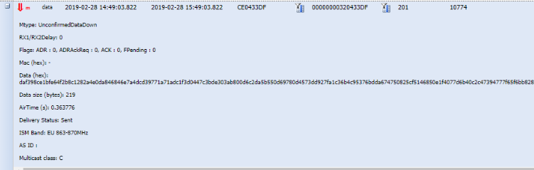
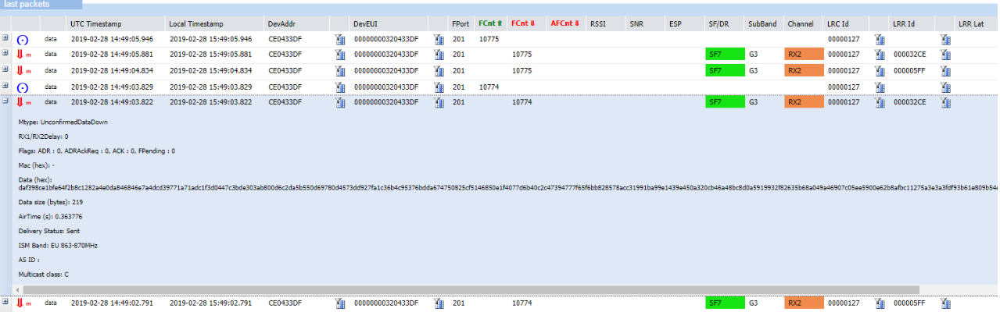
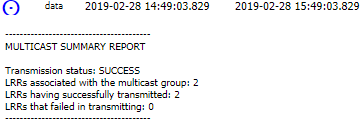
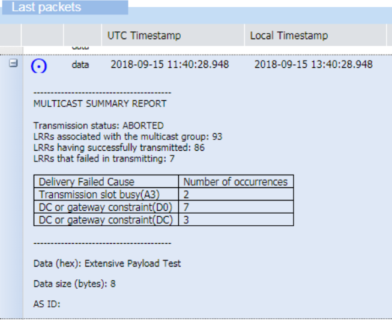

# Downlink LoRaWAN® multicast packets

This topic describes reference information about downlink LoRaWAN®
multicast packets.

## Multicast

Multicast allows a group of devices to receive the same downlink packet
at the same time by transmitting it only once by the base station. It
offers significant downlink capacity gain and optimizes the usage of the
radio resources.

A multicast group is composed of LoRaWAN® devices implementing:

- A regular unicast ABP or OTAA device, associated with a first set of
  `{DevEUI, DevAddr, NwkSKey, AppSKey}` for ABP and `{DevEUI, AppKey}` for
  OTAA

- A virtual ABP device of Class B or C, associated with another set of
  `{DevEUI, DevAddr, NwkSKey, AppSKey}` pre-shared by all members of the
  multicast group.

## Multicast downlinks

**Multicast downlink packets** are represented with a special multicast
flag .

In the expandable panel, the class of the multicast group is indicated:
**Multicast class C**.

### Reattempts of multicast downlink transmission to base stations failed

The same downlink multicast packet may be transmitted displayed several
times in Wireless Logger. This happens when the initial transmission of
the downlink multicast packet was not successful on all the base
stations involved in the multicast session. In this case, the LRC
reattempts to transmit again the downlink packet to via the base station
that reported transmission failure on the previous attempt. The maximum
number of LRC attempts is configured in the multicast connectivity plan
associated with the subscriber's multicast group. By default, it is set
to 3 transmissions.

**Example** This downlink multicast packet has been transmitted more
than once by the LRC. Notice the downlink frame counters 10774 and
10775:

## Multicast downlinks metadata

See [Downlink metadata
columns](downlink-lorawan-unicast-packets.md#downlink-metadata-columns)
and [Downlink expandable
panel](downlink-lorawan-unicast-packets.md#downlink-expandable-panel).

## Multicast summary report

For each downlink multicast packet, Wireless Logger displays a multicast
summary report. The purpose of this report is to give the effective
radio frequency transmission status of the downlink multicast packet.

**Note** Effective radio frequency transmission only ensures that the
downlink packet has effectively been transmitted by an LRR base station.
It does not guarantee that the device has received it.

An example of multicast summary report is provided below, it is
represented by the  symbol.

In this example, the multicast transmission was successful on the two
base stations participating to the multicast session.

In case of transmission failure on one or several LRR base stations,
either after the first transmission attempt by the LRC or after the
maximum number of transmission attempts, the multicast summary report
provides the distribution of LRR failure delivery causes.

Transmission status shows multicast downlink transmission status:

| Transmission status | Explanation                                                                                                                                                 |
|---------------------|-------------------------------------------------------------------------------------------------------------------------------------------------------------|
| **PARTIAL**         | Some LRRs failed to transmit the downlink packet. Another attempt will be made to transmit the packet to theses LRRs.                                       |
| **SUCCESS**         | All LRRs successfully transmitted the downlink packet.                                                                                                      |
| **ABORTED**         | Some LRRs failed to transmit the downlink. No more attempt will be made to transmit the packet to theses LRRs (maximum number of attempts already reached). |

| Cause value | Category name                                                                                                                                                                                                                                                                                                                                                                              |
|-------------|--------------------------------------------------------------------------------------------------------------------------------------------------------------------------------------------------------------------------------------------------------------------------------------------------------------------------------------------------------------------------------------------|
| **Ax**      | **Transmission slot busy**   - (A0) **Radio stopped**   - (A1) **Downlink radio stopped**   - (A2) **Ping slot not available** (Class B multicast only)   - (A3) **Radio busy**   - (A4) **Listen before talk**   - (A5) **Radio board error**                                                                                                                     |
| **Bx**      | **Received too late for ping slot**   - (B0) **Too late for ping slot**                                                                                                                                                                                                                                                                                                            |
| **Dx**      | **Duty cycle or gateway constraint**   - (D0) **Duty cycle constraint detected by LRR**   - (DA) **Duty cycle constraint detected by LRC**   - (DB) **Max dwell time constraint detected by the LRC**   - (DC) **No GPS-synchronized LRR detected by the LRC** (Class B multicast only)   - (DD) **No LRR connected detected by the LRC**   - (DF) **Wrong NetID** |
| **Ex**      | **Frame expired before transmitting**   - (E0) **Max delay for Class C** - 60 seconds                                                                                                                                                                                                                                                                                                  |

**Example** In the following multicast summary report, we can see that a
transmission slot has been twice busy (**A3**) while the failure causes
of the gateway constraint have occurred 7 times (**D0**) and 3 times
(**DC**).

