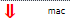
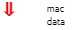
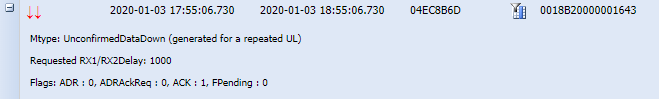
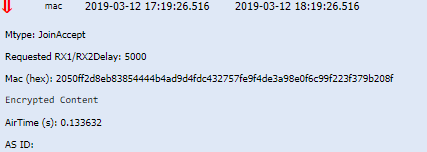
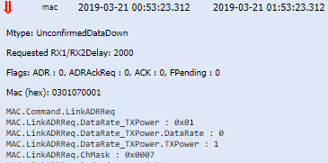
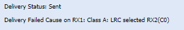
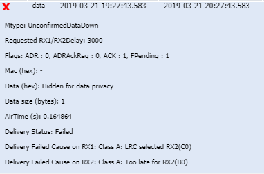

# Downlink LoRaWAN® unicast packets

This topic describes reference information about downlink LoRaWAN®
unicast packets.

## Downlink packets

Downlink packets are LoRaWAN® packets sent by base stations to the
device. They are represented in Wireless Logger by:

- In case of transmission success by the LRR base station, the different icons and their meaning is shown below:

    | Icon | Description             |
    | ------ | ----------|
    |  | This icon illustrates radio transmission success of downlink              |
    |   | This icon illustrates downlinks generated for a repeated uplink. For more information, see [Downlinks generated for a repeated uplink](#downlinks-generated-for-a-repeated-uplink) |
    |  | This icon illustrates radio transmission failure of downlink |

You can see and filter several categories of downlink packets in
Wireless Logger according to their content. A frame is a packet.

| Downlink packet                                        | Content                | Description                                                                                                                                                                                                                                                                                                 |
|--------------------------------------------------------|------------------------|-------------------------------------------------------------------------------------------------------------------------------------------------------------------------------------------------------------------------------------------------------------------------------------------------------------|
|    | **MAC frames**         | When a downlink packet is tagged **mac** only, it means that the packet does not contain any application payload from the application server. These packets are either downlink packets carrying only Layer-2 LoRaWAN® MAC commands and/or MAC acknowledgements to a previous uplink **confirmed** packets. |
|    | **Data frames**        | These packets contain an application payload that is generated by application servers but do not contain any MAC commands.                                                                                                                                                                                  |
|    | **MAC + Data frames**  | These downlink packets contain both MAC commands/acknowledgments and application payload.                                                                                                                                                                                                                   |
|  | **Join Accept frames** | These downlink packets are only relevant for OTA devices                                                                                                                                                                                                                                                    |

## Downlinks generated for a repeated uplink

When the same uplink packet is transmitted several times by the device
(that is frame repetition), only one copy of this uplink packet is
visible in Wireless Logger and sent to application servers thanks to the
LRC deduplication mechanism.

However, since each individual uplink transmission by the device allows
two downlink scheduling slots (RX1 and RX2), the LRC can send downlink
packets on RX1 or RX2 slots of a repeated uplink packet.

To avoid any ambiguity:

- The icon for **Downlinks for a repeated
  uplink** notifies that the downlink packet in question is sent in
  response to an uplink packet that is masked by deduplication

- In the expandable panel, **LoRaWAN® MType** is appended by
  **(generated for a repeated UL)**.

  

## Downlink metadata columns

Metadata is a series of information related to the transmission or
reception of each uplink packet. It allows you to monitor the radio
conditions of each packet and the network-based MAC layer
configurations.

The most important downlink metadata are directly displayed as distinct
columns in Wireless Logger and are listed in the following table. For
more information about other metadata displayed in the expandable panel
of the packet, see [Downlink expandable panel](#downlink-expandable-panel).

In the downlink packet content, **ACK flag = 1** means that the downlink
packet acknowledges the reception by the network of the last uplink
packet.

This topic also applies to multicast and passive roaming downlinks. For
more information, see [Downlink LoRaWAN® multicast packets](downlink-lorawan-multicast-packets) and [Passive roaming LoRaWAN® packets](passive-roaming-lorawan-packets).

| Metadata                 | Description                                                                                                                                                                    |
| ------------------------ | ------------------------------------------------------------------------------------------------------------------------------------------------------------------------------ |
| **Message direction**    | Green arrow shows the downlink packet (from the LRC to the device); the green arrow the uplink packet (from the device to the LRC).                                            |
| **Message type**         | - **data**: indicates that the packet contains some application payload sent by application server.                                                                            |
|                          | - **mac**: indicates that the packet contains some MAC layer service commands (such as ADR modification).                                                                       |
|                          | - **join**: indicates the Join Accept message (for OTA devices).                                                                                                               |
| **UTC Timestamp**        | UTC timestamp, using ISO 8601 format.                                                                                                                                          |
| **Local Timestamp**      | Timestamp translated to the browser time zone, using ISO 8601 format.                                                                                                           |
| **DevAddr**              | Device address (4 bytes).                                                                                                                                                      |
| **DevEUI**               | Device EUI (8 bytes) is a global end-device ID in IEEE EUI64 address space that uniquely identifies the end-device. If the network server acts as a forwarding network server (fNS) and the message type is data, the DevEUI is only available if LoRaWAN® Backend Interfaces version > 1.0. |
| **FPort**                | Application port of the packet.                                                                                                                                               |
| **NFCnt**                | Downlink frame counter maintained by the LRC network server.                                                                                                                    |
| **AFCnt**                | Downlink frame counter maintained by the application server.                                                                                                                     |
| **SF/DR**                | Spreading Factor or Data Rate of the downlink packet.                                                                                                                           |
| **Sub Band**             | Radio frequency sub band corresponding to the logical channel used to transmit the downlink packet to the device.                                                               |
| **Channel**              | Logical Channel (LC) used to transmit the downlink packet to the device. **Note:** The following color legend applies to downlink packets transmitted after the upgrade to release 6.0: When the downlink packet is sent over RX1 slot, the LC-ID is displayed over white background. When the downlink packet is sent over RX2 slot: In case of Join Accept message, RX2 is displayed over orange background. For all other cases, the LC-ID is displayed over orange background. When the downlink packet is sent over a class B pingslot, the LC-ID is displayed over blue background. |
| **LRC Id**               | Identifier of the LRC network server.                                                                                                                                         |
| **LRR Id**               | ID of the best-LRR base station sending the downlink packet to the device.                                                                                                     |

## Downlink message type

As for uplink, LoRaWAN® specification defines three different message
types (Mtype) for downlink packets:

| Message type (Mtype) | Description |
| -- | -- |
| **Join Accept** | Join Accept is sent by the LoRaWAN® Join Server to grant access to OTA devices. It allows the device to derive the session keys and acquire the mandatory radio frequency parameters configured in the network. It is displayed in Wireless Logger with Mtype: **JoinAccept** as per the following example:    **Note:** The content of the Join Accept message is displayed in encrypted format by Wireless Logger. |
| **Confirmed data down** | If the downlink packet requires an acknowledgment from the device, it is sent in **CONFIRMED mode**. In this case, Wireless Logger displays the message type (Mtype) as **ConfirmedDataDown** |
| **Unconfirmed data down** | Otherwise, downlink packets can be sent in **UNCONFIRMED mode**, meaning that the LRC network server or application server does not request any acknowledgment from the device on its downlink data. This corresponds to the **UnconfirmedDataDown** message type as illustrated by the following example:  |

## Downlink expandable panel

The following elements are displayed in the expandable panel for each
LoRaWAN® downlink packet. To access the expandable panel, click
 on the left side of the packet.

This topic also applies to multicast and passive roaming downlinks. For
more information, see [Downlink LoRaWAN® multicast packets](downlink-lorawan-multicast-packets) and [Passive roaming LoRaWAN® packets](passive-roaming-lorawan-packets).

| Field | Description |
| -- | -- |
| **Foreign Operator NetID** | NetID of the forwarding operator. If the network server acts as a serving network server (sNS), the Foreign Operator NetID is only available if the base station does not belong to the serving network. |
| **Foreign Operator NSID** | Network server identifier of the forwarding operator: - **If the network server acts as a serving network server (sNS)**: the Foreign Operator NSID is only available if the base station does not belong to the serving network and the LoRaWAN® Backend Interfaces version &gt; 1.0.  - **If the network server acts as a forwarding network server (fNS)**: the Foreign Operator NSID is only available if the LoRaWAN® Backend Interfaces version \> 1.0 |
| **Mtype** | Indicates the type of packet: **ConfirmedDataDown**, **UnConfirmedDataDown**, **JoinAccept**. For more information, see [Downlink message type](#downlink-message-type) |
| **Flags** | MAC layer flags available in the Frame Header (for more details, see LoRaWAN® 1.0.3 MAC Layer specification): - **ADR**: always set to 1 if the command **LinkADRReq** is supported in the device profile of the device. - **ACK**: set to 1 if the packet contains an acknowledgement to the previous uplink packet, 0 otherwise. - **ADRACKReq**: not relevant for downlink packets. - **FPending**: set by the network to inform the device that other downlink packets are waiting for transmission on the network side. | 
| **MAC (hex)** |Contains the downlink MAC commands in hexadecimal format. **Note:** Wireless Logger also displays MAC commands in decoded format in the expandable panel. |
| **Data (hex)** | Contains the downlink application payload in hexadecimal format. |
| **Driver metadata** | Metadata associated with the device profile corresponding to the device in question. This metadata allows Wireless Logger application to automatically map the device to the right payload decoder from the list of IoT Flow drivers (for more details, see [Decoding LoRaWAN® payloads](../analyzing/decode-lorawan-payload)|
| **Data size (bytes)** | Size of the application payload in bytes. |
| **AirTime (s)** |Time duration of the packet over the air (in seconds). | 
| **Delivery Status** | Transmission status of the downlink packet by the LRR base station: - **Sent**: the downlink packet was successfully sent by the LRR. **Note:** Successful transmission by the LRR does not guarantee successful reception by the device, due to potential loss of the packet over the air (collision, link budget issues…). - **Failed**: the downlink packet could not be sent by the LRR over the air interface. The delivery failure cause on RX1/RX2/Pingslot (the latter is exclusive to class B devices) is provided by Wireless Logger. For more information, see [Downlink delivery failure causes](#downlink-delivery-failure-causes). | 
| **ISM Band** | LoRaWAN® ISM band associated with the device and the selected base station (BestLRR or BestGWID). |
| **RF Region** | RF region of the selected base station (BestLRR or BestGWID). |
| **AS ID** | ThingPark ID of the application server or application servers sending the downlink packet to the device. |
| **Frequency** | Physical frequency (in MHz) used by the network to transmit the downlink packet. The corresponding Logical Channel is displayed in the **Channel** column. |
| **Status** | Transmission status of the report sent by the LRC to the Application Server identified by the AS ID. Two possibles values are: OK or Error. In case of error, a message is displayed in the **Transmission errors** column.  **Note:** This status is only relevant for "Basic HTTP" type of connections. Delivery errors related to TPX connections are currently not visible in Wireless Logger. |
|**Transmission errors** | **Idx**: Index of the destination that caused the error. Starting value at 0. **Url**: The destination URL that returned the error. An HTTP Application Server can be configured with several destination URLs.   **Status**:  - **Timeout**: The report was not successfully acknowledged by the destination within the expected timeframe.  - **Error**: The report was rejected by the destination. (HTTP error, network error, DNS error).  - **Overload**: The report was not sent to the destination because the network server reached the OVERLOAD state and the destination's average round trip time is too bad. - **Blacklist**: The report was not sent to the destination because the network server reached the BLACKLIST state and the destination's average round trip time is bad. - **Unreachable**: The report was not sent to the destination because this destination was deemed unreachable due to irresponsive behavior over the last observation window.  **Note:** This information is only relevant for "Basic HTTP" type of connections. Delivery errors related to TPX connections are currently not visible in Wireless Logger. |
| **Confirmed network frame counter up (ConfFCntUp)** |Only valid for LoRaWAN® 1.1 devices when the downlink packet acknowledges the last uplink packet sent in confirmed mode. It indicates the uplink frame counter FCntUp being confirmed by the LRC (ACK sent by the LRC).This field is visible in the downlink expandable panel. |

## Downlink delivery failure causes

For every downlink transmission from the network towards the device,
Wireless Logger displays the following information in the expandable
panel:

- **Downlink status**, with two possible values:

  - Sent: If the downlink packet was
    successfully transmitted by the LRR base station.  
    **Note** Successful transmission by the LRR base station does not
    guarantee successful reception by the device as the downlink packet
    might be lost over the air (due to collision for instance, or bad
    radio frequency coverage). **Example** While the delivery status is
    Sent, Wireless Logger displays a
    failure cause on RX1 because the downlink packet was sent on RX2
    instead of RX1. In this specific case, the RX2 choice is driven by
    the LRC RX1/RX2 selection algorithm (also known as RX2
    Optimization).

    

  - Failed: If the downlink packet could
    not be sent by the LRR base station. In this case, the delivery
    failure cause on RX1 and RX2 (and pingslot for class B devices) is
    indicated by Wireless Logger as illustrated by the following example
    for class A device:

    

&nbsp;

- **Delivery Failed Cause** on RX1/RX2/Pingslots

  **Reminder** Downlink packets can be scheduled over RX1 and
  class-A-RX2 slots for all the device classes (A/B/C). They can be
  additionally scheduled on the extended RX2 window for class C devices
  and the pingslots of class B devices.

  &nbsp;

  The following table details the different delivery failure causes on
  RX1/RX2/Pingslots:

| Cause value                                                                                                                                     | Category name                                                                                                                                                                                                                                                                                                                                                                                                                                                                                                                                                                                                                                                                                                                                                                                                                            |
|-------------------------------------------------------------------------------------------------------------------------------------------------|------------------------------------------------------------------------------------------------------------------------------------------------------------------------------------------------------------------------------------------------------------------------------------------------------------------------------------------------------------------------------------------------------------------------------------------------------------------------------------------------------------------------------------------------------------------------------------------------------------------------------------------------------------------------------------------------------------------------------------------------------------------------------------------------------------------------------------------|
| **Over the air delivery error causes  for RX1 downlink slot   All device classes**                                                            | **Transmission slot busy on RX1** - (A0) Radio stopped - (A1) Downlink radio stopped - (A3) Radio busy - (A4) Listen before talk - (A5) Radio board error.. - (A6) Specific Semtech basic station failure cause  **Received too late for RX1** - (B0) Too late for RX1  **LRC selects RX2** - (C0) LRC selected RX2  **DC or gateway constraint on RX1** - (D0) Duty cycle constraint detected by LRR - (DA) Duty cycle constraint detected by LRC - (DB) Max dwell time constraint detected by the LRC - (DE) DC not allowed by the peering operator - (DF) Wrong NetID  **Frame discarded from the downlink queue** - (E1): Queue full - (E2): Invalid FCntDn - (E3): Validity time expired - (E4): Queue reset following a rejoin |
| **Over the air delivery error causes  for RX2 downlink slot   All device classes**                                                            | **Transmission slot busy on RX2** - (A0) Radio stopped - (A1) Downlink radio stopped - (A3) Radio busy - (A4) Listen before talk - (A5) Radio board error.. - (A6) Specific Semtech basic station failure cause  **Received too late for RX2** - (B0) Too late for RX2  **DC or gateway constraint on RX2** - (D0) Duty cycle constraint detected by LRR - (DA) Duty cycle constraint detected by LRC - (DB) Max dwell time constraint detected by the LRC - (DE) DC not allowed by the peering operator - (DF) Wrong NetID                                                                                                                                                                                                                                              |
| **Over the air delivery error causes  for RX2 downlink slot   Class C devices only**                                                          | **Class C device - Frame expired before transmission**   -(E0) Max delay for Class C (60 seconds)                                                                                                                                                                                                                                                                                                                                                                                                                                                                                                                                                                                                                                                                                                                                                                           |
| **Class C device - Frame expired before transmission  Over the air delivery error causes  for downlink pingslots   Class B devices only** | **Transmission slot busy on ping slot** - (A0) Radio stopped - (A1) Downlink radio stopped - (A2) Ping slot not available - (A3) Radio busy - (A4) Listen before talk - (A5) Radio board error..  **Received too late for ping slot** - (B0) Too late for ping slot  **DC or Gateway constraint on ping slot** - (D0) Duty cycle constraint detected by LRR - (DA) Duty cycle constraint detected by LRC - (DB) Max dwell time constraint detected by the LRC - (DC) No GPS-synchronized LRR detected by the LRC - (DD) No LRR connected detected by the LRC - (DF) Wrong NetID                                                                                                                                                                                      |
