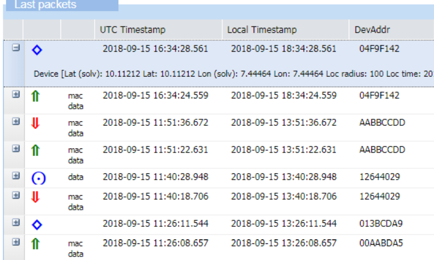
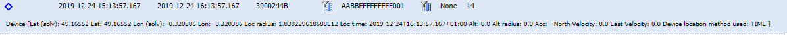

# Location reports
:::warning Note
- The location reports are only applicable to LoRaWAN devices
:::

The location report informs
asynchronously about the geolocation data associated to the current
uplink packet (current **FCntUp**), as soon as available from the
location server.

 

In the expandable panel of the location report, the following
information is available:

| Metadata | Description |
| -- | --|
| **Device Lat** and **Lon** | Latitude and longitude estimated by ThingPark Location Solver. |
| **Location radius** |Defines a horizontal circle inside which the position of the device is estimated. |
| **Location time** | Indicates the time when the device location was estimated by the Location Solver engine. |
| **Altitude** and **Altitude radius** | Estimated device altitude. The altitude radius defines a vertical circle inside of which the altitude of the device is estimated |
| **Accuracy** | Estimated accuracy of the device location. |
| **Velocity estimation** | Device velocity (**North** & **East** direction) expressed in m/s.|
| **Device location method used** | Determines whether the Location Solver engine used **TDoA** (Time based) or **RSSI** algorithm to generate the location report in question. This information is particularly interesting when the geolocation algorithm is configured to use <em>both</em> TDoA and RSSI modes.|
| **Status** | Transmission status of the report sent by the LRC to the Application Server identified by the AS ID. Two possibles values are: OK or Error. In case of error, a message is displayed in the **Transmission errors** column.  **Note:** This status is only relevant for "Basic HTTP" type of connections. Delivery errors related to TPX connections are currently not visible in Wireless Logger. |
|**Transmission errors** | **Idx**: Index of the destination that caused the error. Starting value at 0. **Url**: The destination URL that returned the error. An HTTP Application Server can be configured with several destination URLs.   **Status**:  - **Timeout**: The report was not successfully acknowledged by the destination within the expected timeframe.  - **Error**: The report was rejected by the destination. (HTTP error, network error, DNS error).  - **Overload**: The report was not sent to the destination because the network server reached the OVERLOAD state and the destination's average round trip time is too bad. - **Blacklist**: The report was not sent to the destination because the network server reached the BLACKLIST state and the destination's average round trip time is bad. - **Unreachable**: The report was not sent to the destination because this destination was deemed unreachable due to irresponsive behavior over the last observation window.  **Note:** This information is only relevant for "Basic HTTP" type of connections. Delivery errors related to TPX connections are currently not visible in Wireless Logger. |
