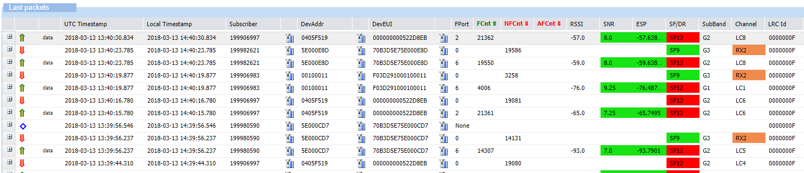

# LoRaWAN® traffic overview

This topic describes LoRaWAN® summary information displayed in the Last packets list. For more information, see
[Viewing the traffic](../viewing/view-traffic).

## LoRaWAN® packets

### Unicast packets
| Symbol | Name | Description |
|--------|------|-------------|
|  | **Unicast uplink** | Transmission success to all application servers|
|  |**Failed unicast uplink**|Transmission failure to at least one application|
|  | **Unicast downlink**|Radio transmission success|
|  | ** Failed unicast downlink** |Radio transmission failure|
|  | **Unicast downlinks for a repeated uplink** | Downlinks generated for a repeated uplink|

### Multicast
| Symbol | Name | Description |
|--------|------|-------------|
|  | **Multicast downlink** | Multicast downlink|
|  |**Failed multicast downlink**|Radio transmission failure|

### Forwarding passive roaming
The network server acts as a forwarding network server. Applies to Wireless Logger attached to a network partner account or to a subscriber account with a Network Manager subscription.

| Symbol | Name | Description |
|--------|------|-------------|
| |**Passive roaming uplink (fNS)** | Uplink transmitted to the serving network server of the foreign device.|
|  | **Passive roaming downlink (fNS)** | Downlink sent by the  serving network server of the foreign device roaming in on my network. The downlink was successfully radio-transmitted by one of my base stations.|
|  | ** Failed passive roaming downlink (fNS)** | Downlink sent by the  serving network server of the foreign device roaming in on my network. The donwnlink was unsuccessfully radio-transmitted by one of my base stations | 

### Serving passive roaming

The network server acts as a forwarding network server. Applies to Wireless Logger attached to a network partner account or to a subscriber account with a Network Manager subscription.

| Symbol | Name | Description |
|--------|------|-------------|
|  |**Passive roaming uplink (sNS)**|Transmission success to all application servers of an uplink of one of my devices roaming out on a foreign network and passing through a foreign base station.|
|  |**Failed passive roaming uplink (sNS)**|Transmission failure to at least one application server of an uplink of one of my devices roaming out on a foreign network and passing through a foreign base station.|
| |**Passive roaming downlink (sNS)**|Radio transmission success of a downlink of one of my devices roaming out on a foreign network and passing through a foreign base station.|
|  |**Failed passive roaming downlink (sNS)** | Radio transmission failure of a downlink of one of my devices roaming out on a foreign network and passing through a foreign base station.|

## LoRaWAN® reports

### Unicast

| Symbol                           | Name                    | Description                                                           |
|----------------------------------|-------------------------|-----------------------------------------------------------------------|
|  | **Location report**     |                                                                       |
|     | **Device reset report** | Only available if Wireless Logger is attached to a subscriber account |

### Multicast

| Symbol                                   | Name                         |
|------------------------------------------|------------------------------|
|  | **Multicast summary report** |

## Radio color codes

Wireless Logger displays a range of colors for radio parameters that are
subject to limited values in the columns of the Last packets list. For more
information about LoRaWAN® radio parameters, see [LoRaWAN® radio statistics](#lorawan-radio-statistics).

### Signal-to-Noise Ratio and Estimated Signal Power

In the SNR and ESP
columns, Signal-to-Noise Ratio and Estimated Signal Power
parameters apply the following rules:

| Parameter                        | Green               | Orange                          | Red                 |
|----------------------------------|---------------------|---------------------------------|---------------------|
| **Signal-to-Noise Ratio (SNR)**  | `value ≥ - 8 dB`    | `- 13 dB ≤ value ≤ - 8 dB`      | `value < - 13 dB`   |
| **Estimated Signal Power (ESP)** | `value ≥ - 100 dBm` | `- 110 dBm ≤ value ≤ - 100 dBm` | `value < - 110 dBm` |

### Spreading Factor or Data Rate

In the **SF/DR** column, if a Spreading Factor or a Data Rate displays a
value, the following rules apply:

| Spreading Factor or Data Rate value | Displayed color |
|-------------------------------------|-----------------|
| Value ≤ SF10                        | Green           |
| Value is SF11                       | Orange          |
| Value is SF12                       | Red             |
| Value is FDRx                       | Cyan            |

### RX2

If the value displayed in the **Channel** column is RX2, it is displayed
in orange.

## LoRaWAN® radio statistics

This topic provides information about the calculation of LoRaWAN® radio
parameters. They apply to uplinks.

### Estimated Signal Power (ESP)

Estimates the real received signal strength of a desired signal
considering the impact of background noise.

Being the received signal strength of the useful signal, it
represents the S component in the Signal-to-Noise Ratio (SNR) formula.
Therefore, ESP can be computed as follows:
- ESP = Tx EIRP – Path Loss + Rx antenna gain
- ESP = RSSI – 10*LOG( 1 + 10(-SNR/10) )

Allows assessing how good the received signal is compared to the
minimum sensitivity level of the receiver. It is expressed in dBm and
always has negative values.

### Received Signal Strength Indicator (RSSI)

Determines the total received signal strength within a channel
bandwidth summing up the useful signal (S), the interference (I), and
the background noise (N).

Expressed in dBm, RSSI is the sum S + I + N.

### Signal-to-Noise Ratio (SNR)

Determines the quality of the reception through the ratio between
the received signal strength of the useful signal (S), and the signal
strength of the interference (I) added to the one of the background
noise (N).

It is computed like this: SNR = S/(I+N). It is expressed in
dB.

The higher the SNR (for instance positive SNR as opposed to
negative SNR), the better the reception quality.
