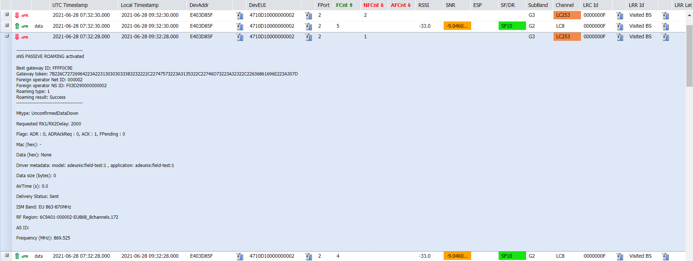

# Passive roaming LoRaWAN® packets

This topic describes reference information about passive roaming
LoRaWAN® packets.

## Passive roaming

Passive roaming is a mode by which a device can seamlessly roam away
from home and uses base stations of the visited network --- connected to
a forwarding network server (fNS) --- to reach its home network.

The following terminology is used in passive roaming mode:

- A **serving network server** (**sNS**) or home network server (hNS) is
  where the device is provisioned. sNS manages the interface with the
  device's application server.

- A **forwarding network server** (**fNS**) is an intermediate network
  server used as a bridge between the device and the serving network
  server. It forwards the LoRaWAN® packets between the device and the
  sNS when the device roams in a zone covered by the base stations of
  the visited network.

- The serving and visited networks must have a roaming agreement in
  place.

The device's Over-The-Air activation mode is visible on the sNS, both
from the network partner's and subscriber's Wireless Logger interfaces:

- **On the visited network (fNS)** LoRaWAN® packets of roaming devices
  are displayed on the Wireless Logger attached to the network partner
  on the fNS. This allows the network partner of the visited network to
  monitor *all* the traffic routed through its base stations, including
  roaming traffic.

- **On the home network (sNS)**

  - LoRaWAN® uplink/downlink packets are displayed on the Wireless
    Logger attached to the subscriber of the sNS. This allows the
    subscriber to monitor all the LoRaWAN® traffic of their devices
    whatever they are at home or roaming on other networks.

  - If an uplink packet is received by both fNS and sNS, then the packet
    is displayed on the Wireless Logger attached to the network partner
    on the sNs, only if the best-LRR (having the highest uplink SNR
    among all the receiving base stations) belongs to the sNS.

## Passive roaming packets

There are two categories of passive roaming packets:

- **Forwarding passive roaming**: The network server acts as a
  forwarding network server (fNS).

- **Serving passive roaming** The network server acts as a serving
  network server (sNS).

To see all types of passive roaming packets, see [LoRaWAN® traffic
overview](lorawan-traffic-overview.md#lorawan®-packets).

## Passive roaming metadata

- For uplinks, see [Uplink metadata
  columns](uplink-lorawan-packets.md#uplink-metadata-columns) and
  [Uplink expandable
  panel](uplink-lorawan-packets.md#uplink-expandable-panel).

- For downlinks, see [Downlink metadata
  columns](downlink-lorawan-unicast-packets.md#downlink-metadata-columns)
  and [Downlink expandable
  panel](downlink-lorawan-unicast-packets.md#downlink-expandable-panel).
