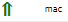
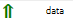
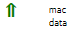
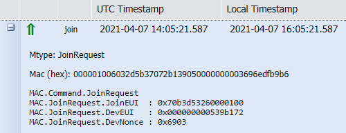
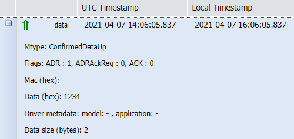
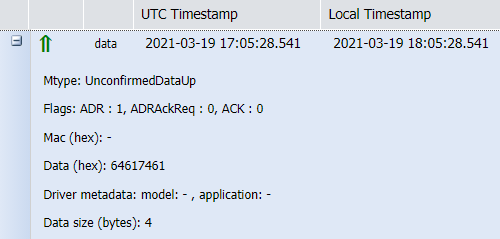
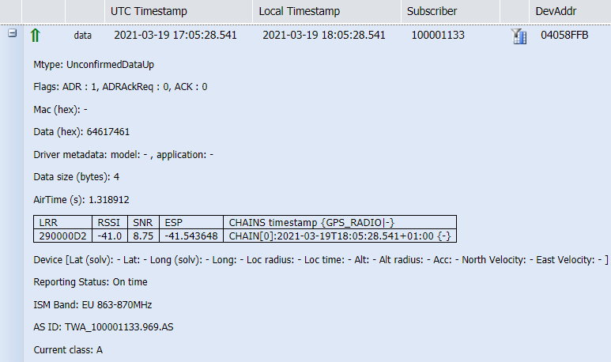

# Uplink LoRaWAN® packets

This topic describes reference information about uplink LoRaWAN®
packets.

## Uplink packets

Uplink packets are LoRaWAN® packets sent by devices to the ThingPark
network. They are represented in Wireless Logger by a symbol. To learn
more about packet symbols, click [LoRaWAN® traffic
overview](lorawan-traffic-overview.md#lorawan®-packets).

You can see and filter several categories of uplink packets in Wireless
Logger according to their content. A frame is a packet.

| Uplink packet                              | Content                 | Description                                                                                                                                                                                                                                                                                         |
|--------------------------------------------|-------------------------|-----------------------------------------------------------------------------------------------------------------------------------------------------------------------------------------------------------------------------------------------------------------------------------------------------|
|  | **MAC frames**          | When an uplink packet is tagged **mac** only, it means that it does not contain any application payload towards the application server. These packets are either uplink packets carrying only Layer-2 LoRaWAN® MAC commands and/or MAC acknowledgements to a previous **downlinkconfirmed** packet. |
|  | **Data frames**         | These uplink packets contain application payload that is routed towards application servers but do not contain any MAC commands.                                                                                                                                                                    |
|  | **MAC + Data frames**   | These uplink packets contain both MAC commands/acknowledgments and application payload.                                                                                                                                                                                                             |
|  | **Join Request frames** | These uplink packets are relevant only for OTAA devices.                                                                                                                                                                                                                                            |

## Display of first transmission only for repeated uplink packets

Repeated uplink packets are deduplicated by the LRC network server, so
they are not sent several times to application servers or TWA/Wireless
Logger. Then, when a device sends the same uplink packet multiple times
to the LRC network server (in case of frame repetition), only a single
uplink packet looking like this
 is displayed in Wireless
Logger.

**Example** If the device transmits 3 times the same uplink packet with
frame counter number 39 (if number of transmissions controlled by ADR
algorithm is set to 3 in this case), only the first transmission is
displayed by Wireless Logger whereas the two subsequent retransmissions
are not.

## Uplink metadata columns

Metadata is a series of information related to the transmission or
reception of each uplink packet. It allows you to monitor the radio
conditions of each packet and the network-based MAC layer
configurations.

The most important uplink metadata are directly displayed as distinct
columns in Wireless Logger and are listed in the following table. For
more information about other metadata displayed in the expandable panel
of the packet, see [Uplink expandable panel](#uplink-expandable-panel).

This topic also applies to passive roaming uplinks. For more
information, see [Passive roaming LoRaWAN®
packets](passive-roaming-lorawan-packets).

| Metadata | Description |
| -------- | ----------- |
| **Message direction** | Green arrow shows the uplink packet (from the device to the LRC); the red arrow the downlink packet (from the LRC to the device). |
| **Message type** | **data** indicates that the packet contains some application payload measured by the device (temperature, GPS coordinates and so forth...). **mac** indicates that the packet contains some MAC layer service commands (ADR modification and so forth…). **join** indicates the Join Request message (for OTA devices). |
| **UTC Timestamp** | UTC timestamp, using ISO 8601 format. |
| **Local Timestamp** |Timestamp translated to browser time zone, using ISO 8601 format. | 
 **DevAddr** | Device address (4bytes).| 
|**DevEUI** | Device EUI (8bytes) is a global end-device ID in IEEE EUI64 address space that uniquely identifies the end-device. If the network server acts as a forwarding network server (fNS) and the message type is data, the DevEUI is only available if LoRaWAN® Backend Interfaces version &gt; 1.0. |
| **FPort** | Application port of the packet. | 
| **FCnT** | Uplink frame counter. |
| **LRR RSSI** | RSSI (Received Signal Strength Indicator) of the received uplink packet on LRR side. | 
|**LRR SNR** |SNR (Signal-to-Noise Ratio) of the received uplink packet on LRR side. | 
| **LRR ESP** | ESP (Estimated Signal Power) of the received uplink packet on the LRR side. | 
| **SF/DR** | Spreading Factor or Data Rate of the uplink packet. | 
| **Sub Band** |Radio frequency sub band corresponding to the logical channel used to transmit the uplink packet by the device. |
| **Channel** | Logical Channel used to transmit the uplink packet by the device. |
| LRC Id** | Identifier of the LRC network server. |
| **LRR Id** | ID of the best-LRR having received the uplink packet with the highest SNR. |
| **LRR Lat** | Latitude of the best-LRR. |
| **LRR Long** | Longitude of the best-LRR. |
| **LRR GwCnt** |Number of LRR gateways (LRR base stations) receiving the uplink packet. The system performs a 250ms buffering upon receiving an uplink packet to check if the same packet arrives through other LRRs, in which case the LRR Count is incremented. |
| **MIC** | Message Integrity Checksum.|
| **Device Lat** / **Device Long** / **LoS Distance (m)** / **Map** / **Trip** | Respectively: Device latitude / Device longitude / Distance between the device and the best-LRR / Displays the device and the LRR base station on a map / Displays the location path of the device (if device location is available).  The GPS data are filled only if the device gives its location:  - **Manual location**: Provisioned in Device Manager application - **GPS location reported by the device in the uplink payload**: This option is only valid if the payload decoder is selected and the application session key (AppSKey) of the device is known to ThingPark. For more information, see [Decoding LoRaWAN® payloads](../analyzing/decode-lorawan-payload) -**Network-based geolocation:** based on TDoA/RSSI geolocation algorithms. |

## Receiving base stations and best-LRR

Wireless Logger can display up to ten base stations that have received
the same uplink packet.

Each base station is identified by the LRR-ID receiving the uplink
packet and displays the associated reception radio metadata such as the
RSSI, SNR and ESP.

When the same uplink packet is received by several base stations,
ThingPark identifies the uplink **best-LRR** as the LRR that has
received the uplink packet with the **highest SNR** (Signal to Noise
Ratio).

For more information, see LRR table in [Uplink expandable
panel](#uplink-expandable-panel) and [LoRaWAN® radio
statistics](lorawan-traffic-overview.md#lorawan-radio-statistics).

**Note** For Wireless Logger associated with a network partner account,
only the uplink packets for which the best-LRR belongs to the network
partner account are displayed. If the same uplink packet is received by
several base stations belonging to different network partners, it will
be displayed only in the Wireless Logger of the network partner where
the best-LRR is provisioned.

## Uplink message type

According to LoRaWAN® specification, Wireless Logger can display three
different message types (Mtype) for uplink packets.

| Message type (Mtype) | Description |
| --- | --- |  
| **Join Request** | Join Request is sent by OTA devices to request initial access to the network. It is displayed in Wireless Logger with message type (Mtype) as **JoinRequest**.  |
| **Confirmed data up** | If the uplink packet requires an acknowledgment by the network, it is sent in **CONFIRMED mode**. In this case, Wireless Logger displays the message type (Mtype) as **ConfirmedDataUp**.   |
| **Unconfirmed data up** | Otherwise, uplink packets can be sent in **UNCONFIRMED mode**, meaning that the device does not request any acknowledgment from the network on its uplink data. This corresponds to the **UnconfirmedDataUp** message type.  | 

## Uplink expandable panel

The following elements are displayed in the expandable panel for each
LoRaWAN® uplink packet. To access the expandable panel of each packet,
click **+** the left side of the packet.

This topic also applies to passive roaming uplinks. For more
information, see [Passive roaming LoRaWAN®
packets](passive-roaming-lorawan-packets).

| Field | Description |
| --- | --- |
| **Mtype** | Indicates the type of message: **ConfirmedDataUp**, **UnConfirmedDataUp**, or **JoinRequest**. For more information, see [Uplink message type](#uplink-message-type) | 
| **Flags** | MAC layer flags available in the Frame Header (for more details, see LoRaWAN® 1.0.3 MAC Layer specification): - **ADR**: set to 1 if ADR enabled by the device, 0 otherwise. For more details, see [Adaptive Data Rate](#adaptive-data-rate) - **ACK**: set to 1 if the packet contains an acknowledgement to the previous downlink packet, 0 otherwise. - **ADRACKReq**: set to 1 when the device requests an acknowledgment to validate the network-controlled ADR. |
| **MAC (hex)** | Contains the uplink MAC commands in hexadecimal format. **Note:** Wireless Logger also displays MAC commands in decoded format, in the expandable panel. For more information, see [Decoding LoRaWAN® payloads](../analyzing/decode-lorawan-payload) | 
| **Data (hex)** | Contains the uplink application payload in hexadecimal format. |
| **Driver metadata** | Metadata associated with the device profile corresponding to the device in question. This metadata allows Wireless Logger application to automatically map the device to the right payload decoder from the list of IoT Flow drivers. For more information, see [Decoding LoRaWAN® payloads](../analyzing/decode-lorawan-payload) |
| **Data size (bytes)** | Size of the application payload in bytes. |
| **AirTime (s)** | Time duration of the packet over the air (in seconds).|
| **LRR table** | Reception metadata for each LRR that received the uplink packet (up to 10 LRRs).For more information, see the description of the corresponding parameters. |
| **Device position** |Device position (**Longitude**/**Latitude**) issued from network-based geolocation, if the feature is activated in the connectivity plan of the device and the geolocation solver can resolve the device position based on TDoA/RSSI algorithms.|
| **Reporting Status** | Status of the uplink reporting to ThingPark core network: - **On-time**: the uplink packet was sent by LRR to LRC  core network without significant delay. - **Late**: the uplink packet was delayed in the LRR (that means buffered) before reaching the LRC core network. This is typically due to backhaul instability or temporary outage. |
| **ISM Band** | LoRaWAN® ISM band associated with the device and its best-LRR (BestLRR or BestGWID) |
| **RF Region** | RF region of the best base station (BestLRR or BestGWID).|
| **Foreign Operator NetID** | NetID of the forwarding operator. If the network server acts as a serving network server (sNS), the Foreign Operator NetID is only available if the best base station does not belong to the serving network.|
| **Foreign Operator NSID** | Network server identifier of the forwarding operator. If the network server acts as a serving network server (sNS): the Foreign Operator NSID is only available if the best base station does not belong to the serving network and the LoRaWAN® Backend Interfaces version \> 1.0. If the network server acts as a forwarding network server (fNS): the Foreign Operator NSID is only available if the LoRaWAN® Backend Interfaces version \> 1.0. |
| **AS ID** | ThingPark ID of the application server or applications servers which the uplink packets are routed to. |
| **Frequency** |Physical frequency (in MHz) used by the device to transmit the uplink packet. The corresponding Logical Channel is displayed in the **Channel** column.|
| **Current Class** | Current LoRaWAN® class used by the device, that is **class A/B/C**. **Note:** For LoRaWAN® 1.0.x devices, class A and class C devices cannot dynamically change their class; whereas class B devices can switch between class A and class B depending on application layer and status of the device locking to beacon signal. |*
| **Status** | Transmission status of the report sent by the LRC to the Application Server identified by the AS ID. Two possibles values are: **Ok** or **Error**. A message is displayed in the Transmission errors column. **Note:** This status is only relevant for "Basic HTTP" type of connections. Delivery errors related to TPX connections are currently not visible in Wireless Logger. |
| **Transmission errors** | If Status is **Ok**: None. If Status is **Error**: - **Idx**: Index of the destination that caused the error. Starting value at 0. - **Url**: The destination URL that returned the error. An HTTP Application Server can be configured with several destination URLs. - **Status**: **Timeout**: The report was not successfully acknowledged by the destination within the expected timeframe/ **Error**: The report was rejected by the destination. (HTTP error, network error, DNS error). **Overload**: The report was not sent to the destination because the network server reached the OVERLOAD state and the destination's average round trip time is too bad. **Blacklist**: The report was not sent to the destination because the network server reached the BLACKLIST state and the destination's average round trip time is bad.**Unreachable**: The report was not sent to the destination because this destination was deemed unreachable due to irresponsive behavior over the last observation window.  **Note:** This information is only relevant for "Basic HTTP" type of connections. Delivery errors related to TPX connections are currently not visible in Wireless Logger. |
| **Current pingslot period** | Only valid for class B devices, it defines the pingslot periodicity reported by the device when it uses class B. This field is displayed only when the device uses class B mode. |
| **Confirmed Application frame counter down (ConfAFCntDn)** | Only valid for LoRaWAN® 1.1 devices when the uplink packet acknowledges the last downlink packet sent in confirmed mode. The downlink frame counter AFCntDown acknowledged by the device is retrieved by the LRC after MIC check procedure. **Example:** Confirmed Application frame counter down: 1 |
| **Confirmed network frame counter down (ConfNFCntDn)** | Only valid for LoRaWAN® 1.1 devices when the uplink packet acknowledges the last downlink packet sent in confirmed mode. The downlink frame counter NFCntDown acknowledged by the device is retrieved by the LRC after MIC check procedure. |

## Adaptive Data Rate

Data communication can either use the **Adaptive Data Rate** (ADR) or
not.

If the ADR is enabled on the device, Wireless Logger displays the
following flags in the uplink packet. In this case, the device
authorizes the LRC network server to optimize the uplink Spreading
Factor (SF), number of transmissions and transmission power according to
the ADR algorithm configured in the LRC.

Otherwise, if ADR flag is disabled by the device, especially for moving
devices, Wireless Logger displays **ADR: 0** in the uplink packet.
