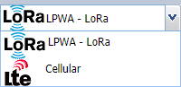

# Switching between technologies

Depending on what you have purchased, your ThingPark Wireless platform
can support both LoRaWAN® and cellular technologies. In that case, every
time you log in to Wireless Logger, it displays the LoRaWAN® interface
and you can switch between connectivity protocols.

1.  From the protocol menu on the right side of the Dashboard, select the technology you want to
    use.

    

    -\> The search bar changes and the packets are loading.
