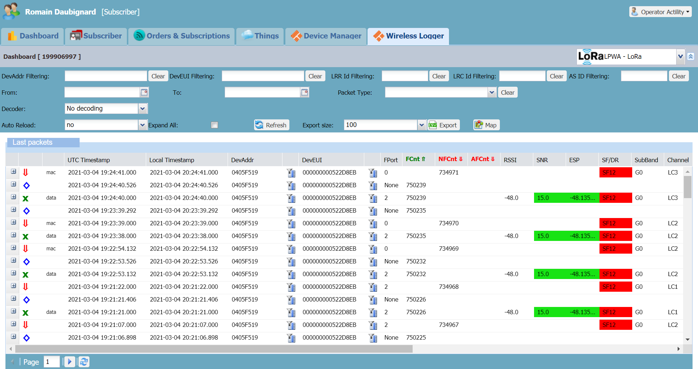
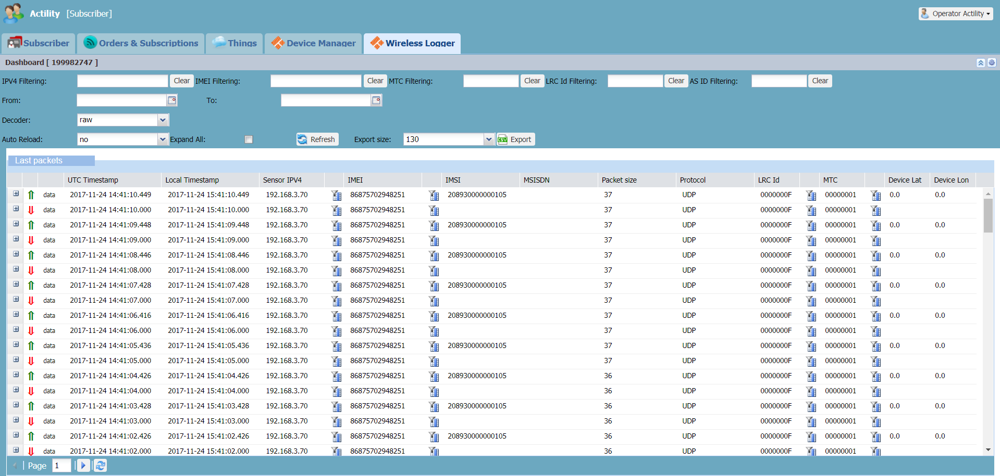
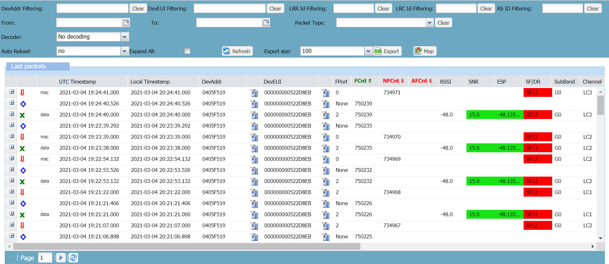

# Viewing the traffic

Once the device is provisioned, you can have an overview of the traffic going
through your LoRaWAN®
:specificContent[or cellular ]{flavor=tpw}
network by displaying up to 10 000 packets in the Dashboard.

The Dashboard contains a search bar and a
result window called the Last packets list.

In the Last packets list:

- The most important metadata of the packets is displayed in columns to
  help you perform a quick analysis and detect issues. Metadata is a
  series of information related to the transmission or reception of the
  packet.

- The list starts with the most recent packets. It can have up to 100
  pages and 1 page can contain 100 packets.

This task also shows you how to reload the packets to refresh the Last packets list.

1.  If Wireless Logger is not opened, apply [Logging     in](../log-in-wireless-logger).

2.  (Optional) If you have been logged in for a while, do one of the
    following to load the latest packets:

    - Click **Refresh** in the search bar.

    - Right-click the **Wireless Logger** tab and click **Reload**.

3.  In page 1 of the Last Packets list:

    **For LoRaWAN®**

    **If Wireless Logger is attached to a subscriber account**, the
    last 100 packets exchanged with the devices provisioned in Device
    Manager or in ThingPark Enterprise appear. The subscriber
    identifier appears in the Dashboard.
    
    
    
    **If Wireless Logger is attached to a network partner account**,
    the last 100 packets exchanged with the base stations provisioned
    in Network Manager appear.

    **For cellular**

    **If Wireless Logger is attached to a subscriber account**, the
    last 100 packets exchanged with the devices provisioned in Device
    Manager appear. The subscriber identifier appears in the Dashboard.

    
    
    In page 1 of the Last Packets list, the
    last 100 packets exchanged with the devices provisioned appear. The
    identifier appears in the Dashboard.

    

4.  Check the different types of packet you have in your traffic. 
    For more information, see 
    :specificContent[[LoRaWAN® traffic overview](../lorawan-traffic/lorawan-traffic-overview).]{flavor=tpe}
    :specificContent[[LoRaWAN® traffic overview](../lorawan-traffic/lorawan-traffic-overview)
    or [Cellular traffic overview](../cellular-traffic-tpw/cellular-traffic-overview).]{flavor=tpw}

6.  Check the most important metadata of the packets that appear in
    columns. 
    :specificContent[     For more information, see [Uplink metadata     columns](../lorawan-traffic/uplink-lorawan-packets.md#uplink-metadata-columns)
    and [Downlink metadata     columns](../lorawan-traffic/downlink-lorawan-unicast-packets.md#downlink-metadata-columns).
    ]{flavor=tpe}

    For more information, see:

    - **For LoRaWAN®**: [Uplink metadata       columns](../lorawan-traffic/uplink-lorawan-packets.md#uplink-metadata-columns)
      and [Downlink metadata       columns](../lorawan-traffic/downlink-lorawan-unicast-packets.md#downlink-metadata-columns)

    - **For cellular**: [Cellular metadata       columns](../cellular-traffic-tpw/cellular-traffic-overview.md#cellular-metadata-columns).

7.  Check the radio parameters that appear in color. For
    more information, see [Radio color     codes](../lorawan-traffic/lorawan-traffic-overview.md#radio-color-codes)
    and [LoRaWAN® radio     statistics](../lorawan-traffic/lorawan-traffic-overview.md#lorawan-radio-statistics).
    :specificContent[(LoRaWAN® only)]{flavor=tpw}

8.  If you want to see all the metadata of a packet, click **Expand**
     on the left side of the packet.

9.  To reload the packets, click **Refresh** anytime you want or use
    [Autoreloading search](../filtering/autoreload).
