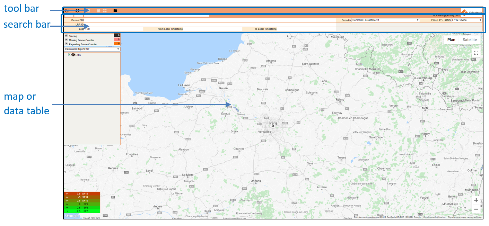

# Interface overview

Once logged into the Network Survey tool, the following window appears:

The interface is based on three frames:

- A tool bar on the top,

- A search bar,

- A main application frame showing the map or the data table.

The tool bar permits to refresh retrieved data, export them, save the
data set in the search bar, switch to the data table view or log out of
the tool.

The search bar is necessary to retrieve the device(s) and gateway(s)
data.

In order for the device data to appear on the map or in the data table,
the search bar needs to be filled first.
