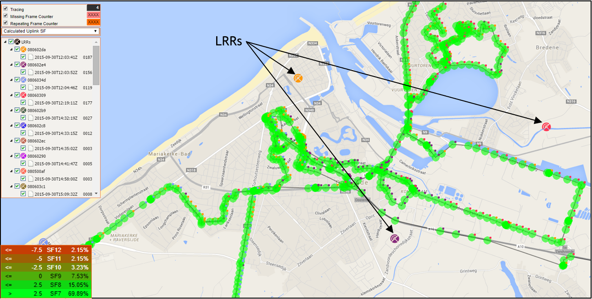
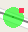
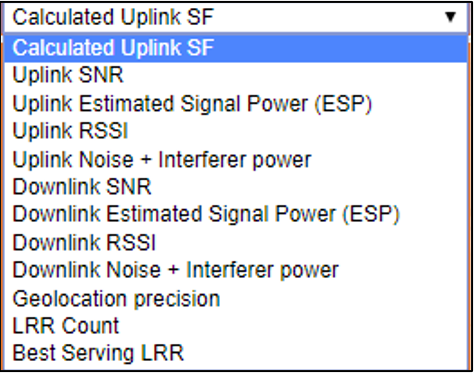
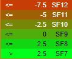
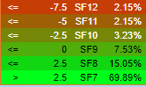
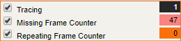
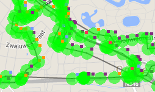
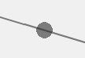
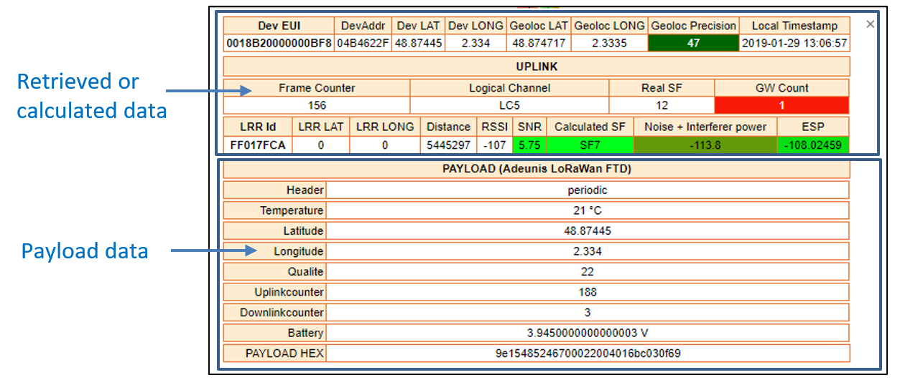
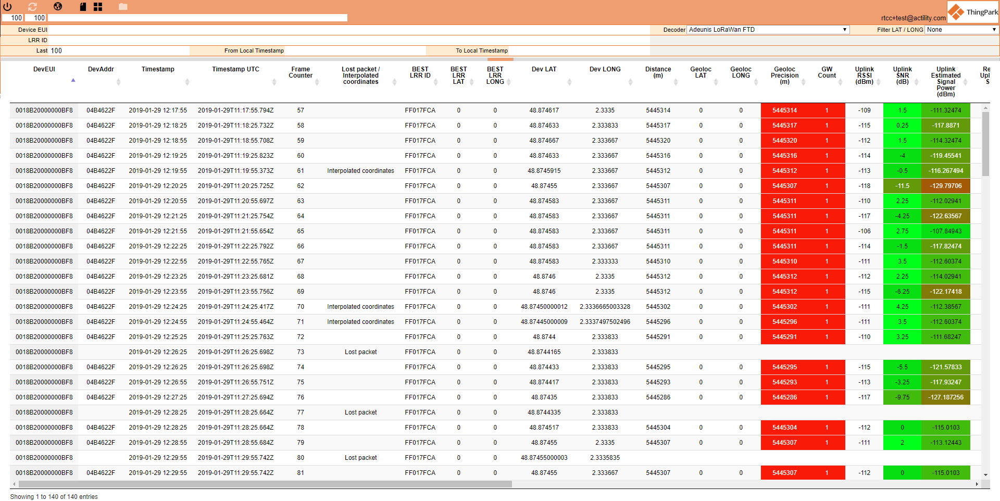

# Views

Data retrieved from Wireless Logger (according to what has been set in
the search bar) can be displayed into two different view in Network
Survey:

- The map view, where data are displayed on a map if the device and/or
  the gateway have GPS coordinates.

- The data table view, where data are displayed into a table.

## Map View

By default, once logged into Network Survey, the displayed view is the
map. When the search bar has been filled, the map is centered
automatically on the GPS coordinates of the first gateway.

The map view consists of LRR locations as well as device packets, each
packet is tagged with a colored square

indicating the serving LRR that best received this packet.

 

### Radio Indicators

In addition to typical radio metrics transmitted from LRR to LRC (for
example, UL RSSI, UL Spreading Factor, UL SNR...), Network Survey tool
allows computing and displaying additional radio metrics, selectable
from a drop-down menu:

- **Calculated Uplink SF**: This metric is derived from the UL SNR
  reported by serving LRR. It gives an estimation of which SF is
  expected when ADR is activated, even when the radio test is performed
  with a fixed SF. The relation between the derived SF and UL SNR is
  indicated in the legend, without any additional ADR margins.

  

- **Uplink SNR**: This metric is retrieved from the UL packets.

  SNR = Signal Power / Noise Floor

- **Uplink Estimated Signal Power (ESP)**: This metric is calculated
  from the UL SNR and UL RSSI.

  Signal Power = RSSI – RSSI / (1+SNR)

- **Uplink RSSI**: This metric is retrieved from the UL packets.

  RSSI = Signal Power + Noise Floor

- **Uplink Noise + Interferer Power**: Based on UL SNR and UL RSSI
  metrics reported by the LRR, the tool computes UL received signal
  power and UL noise floor (including interference) as follows:

  In linear scale: SNR = Signal Power / Noise Floor (Eq.1)

  RSSI = Signal Power + Noise Floor (Eq.2)

  From Eq.1 & Eq.2, it can be derived that:

  Noise Floor = RSSI / (1+SNR)    =\> This is the Noise + Interferer
  power

  Signal Power = RSSI – RSSI / (1+SNR)

- **Downlink SNR**: Depending on the device type, DL measurements like
  the DL SNR may be reported by the device and displayed by the Network
  Survey tool.

- **Downlink Estimated Signal Power (ESP)**: This metric is calculated
  from the DL SNR and UL RSSI.

  Signal Power= RSSI – 10\*LOG( 1 + 10\^(-SNR/10) )

- **Downlink RSSI**: Depending on the device type, DL measurements like
  DL RSSI may be reported by the device and displayed by the Network
  Survey tool.

- **Downlink Noise + Interferer Power**: This metric is calculated from
  the DL SNR and UL RSSI.

- **Geolocation Precision**: Precision of the LoRa geolocation solver.

- **LRR Count**: Number of LRRs that forwarded the packet.

- **Best Serving LRR**: Best LRR that forwarded the packet.

**Note** In each legend, the percentage distribution of each range is
displayed. It corresponds to the proportion of samples in the range with
respect to all the samples displayed:

(# samples within this range) / (Total \# of displayed samples)

###   {#section}

### Display Options

It is also possible to visualize data communication indicators:

- If **Tracing** box is checked, position points are linked together to
  trace all the path.

  

- If **Missing Frame Counter** box is checked, fake packets are
  displayed in grey at locations where uplink packets were dropped (by
  inspecting the UL Frame Count UP field).

  

- If **Repeating Frame Counter** box is checked, the locations where
  uplink packets were repeated (possibly due to a missing DL ACK) are
  displayed.

 

**Note Missing Cnt Up** and **Repeating Cnt Up** values may be set to
XXXX because only some base stations have been chosen, so frames of
others base station are not taken into account, thus these indicators
are not relevant in that case.

 

### Packet Details

Click on a specific point to view the packet details.

Each packet details has different type of data:

- Real data retrieved from Wireless Logger

- Data calculated by the LoRa geolocation solver

- Data calculated by Network Survey

- Data parsed with the payload decoder.

  

Data retrieved from Wireless Logger are the following ones:

- DevEUI

- DevAddr

- Dev LAT

- Dev LONG

- Local Timestamp

- Frame Counter

- Logical Channel

- Real SF

- GW Count

- LRR Id

- LRR LAT

- LRR LONG

- Distance: Line of sight distance between device and serving LRR (in
  meters).

- RSSI

- SNR

- ESP: calculated from the RSSI and SNR

Data calculated by the LoRa geolocation solver are the following ones:

- Geoloc LAT

- Geoloc LONG

- Geoloc Precision

Data calculated by Network Survey are the following ones:

- Calculated SF

- Noise + Interferer Power

The type of data inside the payload depends on the type of device.
Payload-related information:

- Battery status

- Sensor measurements...

**Note** The frame payload can only be decoded if Application Session
Key (AppSKey) is provisioned in ThingPark Wireless.

## Data Table View

To switch to the Data Table view, click

in the tool bar.

The Data Table interface is the following one:

All data displayed on the map and in the packets details are gathered
into the table.
