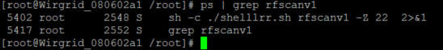
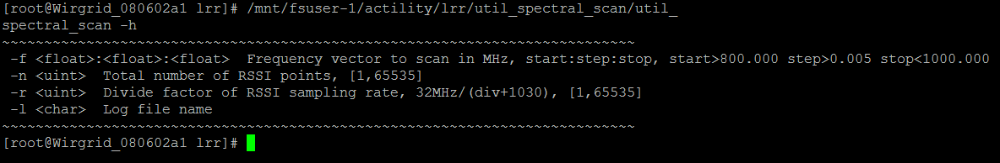
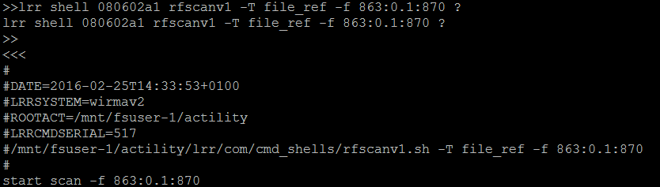

# Launching a Scan from the LRC

The Noise scan execution from the LRC behave as if it were executed from
the GUI.

 

## Basic Execution

Once logged in the LRC associated with the Base Station, send a command
to the LRR to execute the rfscanv1 script:

lrr shell IDLRR rfscanv1 -T NetworkPartnerID ?

The processes rfscanv1 executed on the LRR can be retrieved if you
directly connect to it.

The rfscanv0 script can also be launched from the LRC. Use the following
command:

lrr shell IDLRR rfscanv0 -T NetworkPartnerID ?

 

## Executing a Scan with Custom Parameters

The following parameters can be added to the rfscanv1 script execution:

For example, the following command from the LRC will execute a noise
scan from frequency 863 to 870MHz with a 0.1MHz step.

lrr shell 080602a1 rfscanv1 -T NetworkPartnerID -f 863:0.1:870 ?
 

 
These parameters are not the same for the rfscanv0 script:

lrr shell 080602a1 rfscanv0 -T NetworkPartnerID \--fmin 863000000
\--fmax 870000000 \--fstep 100000 ?
