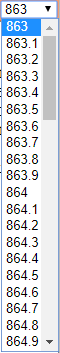
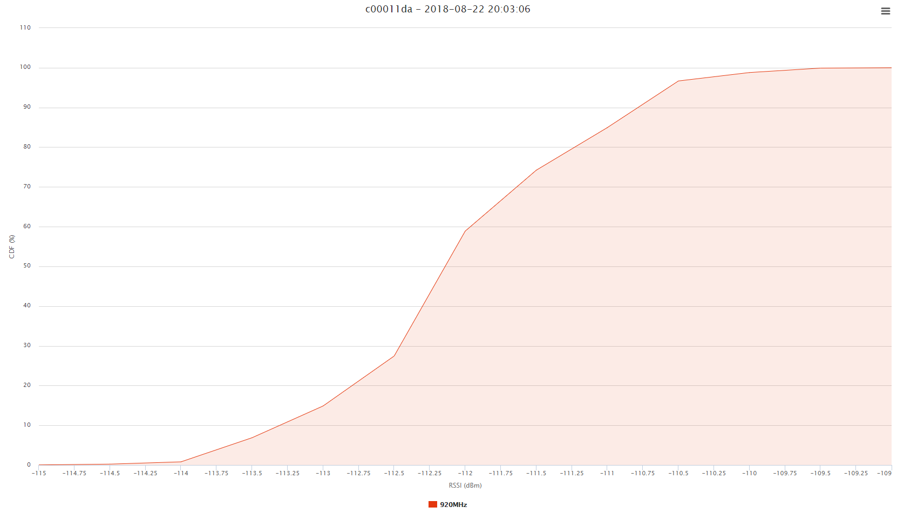

## Displaying RSSI Distribution – One Frequency {#displaying-rssi-distribution-–-one-frequency}

This cumulative distribution function computation permits to analyze in
detail one frequency. It allows to see the repartition of the measured
values, and the impact of extreme values for this frequency. It is
useful to troubleshoot one noisy frequency for example.

To set the frequency to analyze, select it in the drop-down list.

Below is an example of an RSSI distribution for one frequency:

