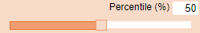
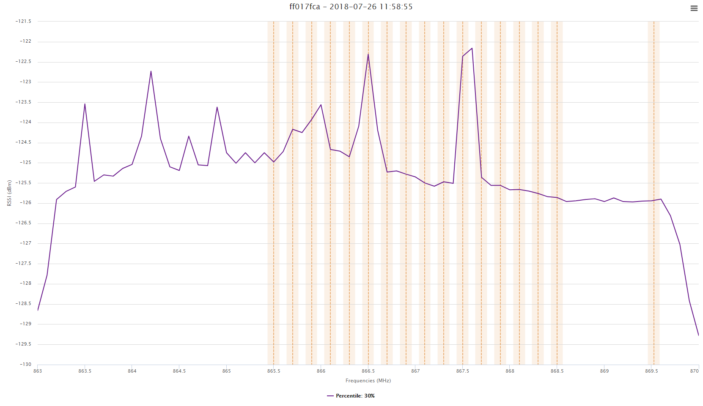
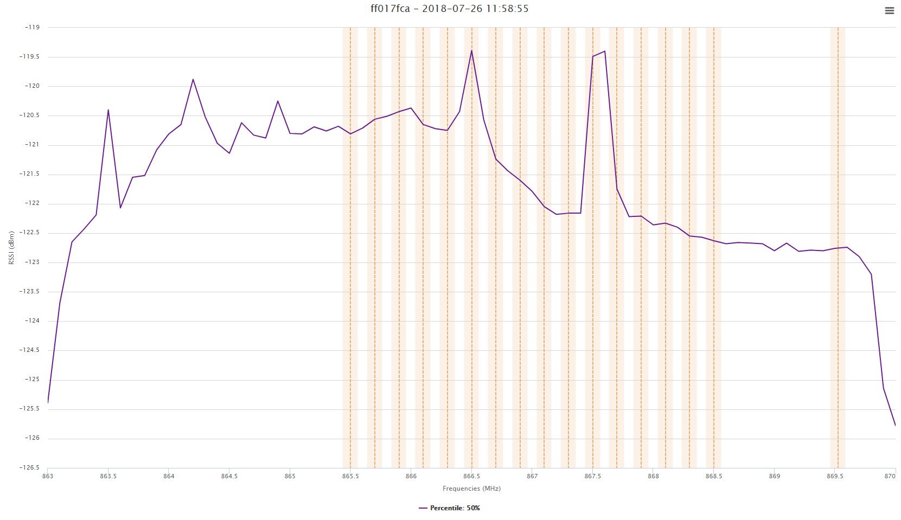
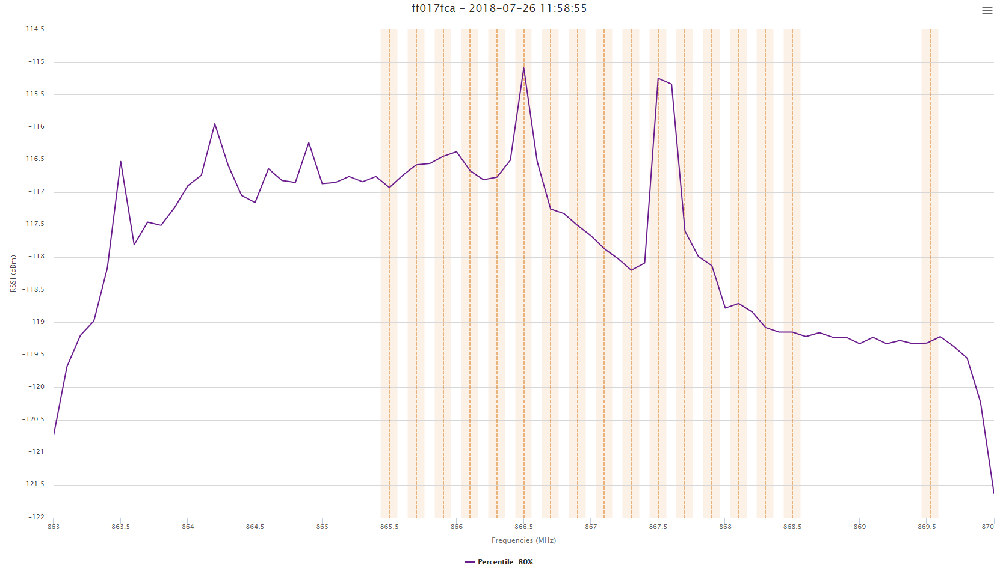

## Displaying RSSI Percentile – All Frequencies {#displaying-rssi-percentile-–-all-frequencies}

This representation allows computing/plotting the RSSI level
corresponding to a specific percentile of the whole distribution. For
example, to compute the median RSSI value for all frequencies, the user
shall set the Percentile to 50%; this computation allows displaying the
data without the extreme RSSI values.

Another example, a percentile set to 95% shows the RSSI level for 95% of
the samples, thus excluding the 5% of the high RSSI values.

To set the percentile value, select it with the scrollbar as displayed
in the following screen.

Relevant percentiles values include: 30%, 50%, and 80%:

## Graph with percentile value at 30%:

## Graph with percentile value at 50%:

## Graph with percentile value at 80%:

