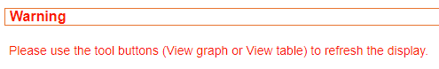

## Generalities

Noise scan results input data may include RSSI values exceeding the
LoRaWAN® RSSI range that really matters. For instance, input data
contains measurements from -147 to 120 dBm, whereas the interesting RSSI
range is \[-130, 0\] dBm in LoRaWAN™ context.

In Spectrum Analysis, out of scope RSSI values are handled by one of the
following policies:

- Either ignore these values.

- Or aggregate them at the range limit (default option at tool
  installation). For example, if a measured value is -133 dBm, it is
  brought to -130 dBm.

To refresh the list of base stations and noise scan result files up to
date, click .

Some files and folder icons are red, others green:

- Red files are noise scan result files in error.

- Green files are correct noise scan result files.

  

### Noise scan result files in error

The noise scan result files in error have a red file icon, and their
checkbox is deactivated. If all the result files of a base station are
in error, the folder of the base station is also red.

A result file is in error if the Spectrum Analysis parser cannot analyze
the result file due to one of the following cases:

- The result file is empty.

- The result file is incomplete.

- The result file has a different format than the one expected.

- The result file is corrupted.

Click on the noise scan result file name to display the error message.

If only one of the result files of a Base Station is in error, it may be
due to a small and punctual incident on the Base Station or during the
result file transfer to the Support or TWA machine.

If all the result files of a Base Station are in error, do the following
checks:

- The parameters for the noise scan execution are correct: the min and
  max frequencies and the step set are relevant.

- The result file format is the one expected (see the example in [What is a noise scan?](../noise-scan-process/what-is-noise-scan))

If these checks are ok, contact Actility.

 

There is 2 ways to select and display the correct noise scan results:

- Using the checkbox

- Directly clicking on the name of the result file

 

### Using the checkbox

To display the noise scan results using the checkbox:

1.  Select the checkbox of the noise scan result(s) to analyze.

    -\> A warning message appears:

    

2.  Select the computation mode:

    

3.  Select the regional profile if needed.

    

4.  Click  to generate the graph, or  to generate the table.

### Clicking on the result file name

To directly display the noise scan results, click on the result file
name.

 

The result is displayed following the previous parameters set :

- The computation mode.

- The regional profile.

- The type of display: graph  or table .

**Note** If a checkbox was previously selected, it remains selected.
But, the graph or the table only displays the result of the file
selected by clicking on it. The title displayed contains the ID of the
Base Station and the name of the result file plotted to avoid any
confusion.

**Important**

- All regional profiles listed are those defined in *LoRaWAN™ Regional
  Parameters v1.0.2*. The frequencies are the default ones listed in
  these regional profiles: that is the 16 channels for EU868, 64
  channels for US915...

- The default RF frequencies typically used for a given regional profile
  are highlighted by the vertical dotted lines on the graphs, and the
  dark orange values in the tabular view. These frequencies are the ones
  defined in the RF Region catalog and are maybe different from the ones
  used on the Base Station.

- To zoom-in and zoom-out in graphs, select a part of the graph by
  clicking, then moving the cursor. Click

  

  on the top right of the graph to zoom out.

- Plotted graph and table can be printed or downloaded in different
  format. Click

  

  on the top right of the graph, and select the action that you wish to
  perform.

  

